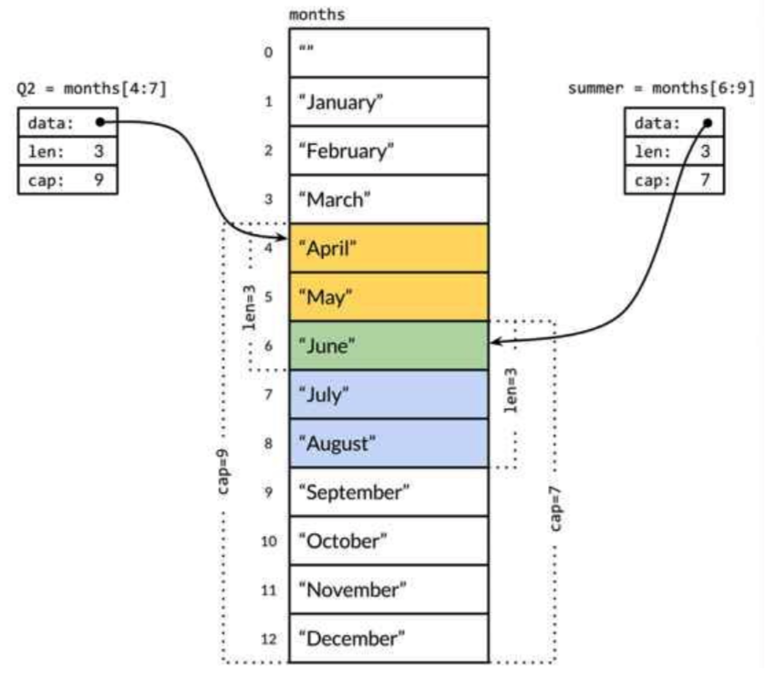

# 05 Data Types - Reference Types

<!-- @import "[TOC]" {cmd="toc" depthFrom=1 depthTo=6 orderedList=false} -->

<!-- code_chunk_output -->

- [05 Data Types - Reference Types](#05-data-types-reference-types)
  - [0. 前言](#0-前言)
  - [1. Pointer & Passing By Value](#1-pointer-passing-by-value)
  - [Slices](#slices)
    - [Slice Declaration](#slice-declaration)
    - [Array and Slice Relation](#array-and-slice-relation)
      - [記憶體管理](#記憶體管理)
        - [Slice Append](#slice-append)
    - [Slice Travel](#slice-travel)
  - [Maps](#maps)
    - [Map Declaration](#map-declaration)
    - [Put](#put)
    - [Delete](#delete)
    - [Get](#get)
    - [Map Travel](#map-travel)

<!-- /code_chunk_output -->

## 0. 前言

Reference types 有：

- __Pointer__
- __Slices__
- __Maps__
- Functions
- Channel

## 1. Pointer & Passing By Value

Pointer 就好比資料在記憶體的地址 (術語：位址, Address)，每一筆資料都會有自己的位址，且可以透過這組位址，來存取該資料。操作的方式如下：

- 取得 Pointer 的方式，與 C 相同，使用 `&` 來取得 Pointer。
- 透過 Pointer 取得資料，與 C 相同，用 `*` 來存取 Pointer 指向的資料。
- 與 C 不同，不能直接對 Pointer 做位移。

```go {.line-numbers}
package main

import "fmt"

func AddByValue(a int) {
	fmt.Printf("Point(%p), Value(%d) of Parameter a\n", &a, a)
	a += 1
}

func AddByPointer(a *int) {
	fmt.Printf("Pointer(%p), Value(%x) of Paramter a\n", &a, a)
	*a = *a + 1
}

func main() {
	a := 10
	b := &a
	*b = 20

	fmt.Println(a) // 20

	arr := [3]int{0, 1, 2}

	p := &arr
	//p++ // invalid operation: p++ (non-numeric type *[3]int)
	fmt.Printf("%p: %v, %v\n", p, p, *p)

	fmt.Printf("Point(%p), Value(%d) of a\n", &a, a)
	AddByValue(a)
	fmt.Printf("%d\n", a) // 20

	fmt.Printf("Pointer(%p), Value(%x) of b (Pointer of a)\n", &b, b)
	AddByPointer(b)
	fmt.Printf("%d\n", a) // 21
}
```

1. 宣告變數，並給定初始值。如：`a := 10`。
1. 取得變數的 Pointer，並命名變數。如：`b := &a`，取得 `a` 的 Pointer，並命名為 `b`。
1. 透過 Pointer，改寫資料。如：`*b = 20`。
1. 此時 `a` 的值，會被改寫成 `20`。
1. 可以透過 `%p`，來列印 Pointer 內的值。`%p` 只能用在 Pointer。

Pointer 可以視作資料的位址，因此每一個變數，都會有自己的 Pointer。Passing by Value 的步驟如下：

1. 宣告一組相同資料型別的變數，將要傳入函式的變數值，複製一份到新的變數。
1. 上述的動作，通常稱為 __Clone__。
1. 函式內的操作都是這組新的變數。

`AddByValue` 與 `AddByPointer` 分別是傳入原生的資料型別與 Pointer。因此也會有不同結果。

執行的結果會類似：

```c
Point(0xc0000160a0), Value(20) of a
Point(0xc0000160d8), Value(20) of Parameter a
20
Pointer(0xc00000e028), Value(c0000160a0) of b (Pointer of a)
Pointer(0xc00000e038), Value(c0000160a0) of Paramter a
21
```

1. `AddByVale` 與 `AddByValue` 的參數 `a`，與傳入的變數，他們的 Pointer 值不同，代表執行了 clone 的動作，產出了新的一份資料，值是原來傳入的變數值。
    - `Point(0xc0000160a0)` v.s. `Point(0xc0000160d8)`
    - `Pointer(0xc00000e028)` v.s. `Pointer(0xc00000e038)`
1. 在 `AddByValue` 中，因為 clone 了 a，因此資料的位址已經不同了，也就是操作不同的資料。
1. 在 `AddByPointer` 中，因為 clone 了 a 的 Pointer，因此再透過 Pointer 值(`Value(c0000160a0)`)操作資料時，因為都是用相同的 Pointer 值，就會修改到 `a`。

## Slices

Slice 與 Array 類似，與 Array 最大不同點是 Slice 的長度是可變動的，但 Array 是固定的。

Slice 組成元素：

- Pointer
- Length
- Capacity

Slice 的 zero value 是 **nil**

### Slice Declaration

`[]T` T 是指資料型別, eg:

```go {.line-numbers}
var s []int
fmt.Println(s, s == nil, len(s), cap(s))    // [] true 0 0

s = nil
fmt.Println(s, s == nil, len(s), cap(s))    // [] true 0 0

s = []int(nil)
fmt.Println(s, s == nil, len(s), cap(s))    // [] true 0 0

s = []int{}
fmt.Println(s, s == nil, len(s), cap(s))    // [] false 0 0

s = []int{1, 2, 3}
fmt.Println(s, s == nil, len(s), cap(s))    // [1 2 3] false 3 3

s = make([]int, 4)
fmt.Println(s, s == nil, len(s), cap(s))    // [0 0 0 0] false 4 4

s = make([]int, 5, 6)
fmt.Println(s, s == nil, len(s), cap(s))    // [0 0 0 0 0] false 5 6
```

### Array and Slice Relation

實際上，Slice 底層還是 Array，Slice 的 pointer 會指定 array 的位置。

```go {.line-numbers}
months := [...]string{1: "January", /* ... */, 12: "December"}
Q2 := months[4:7]
summer := months[6:9]
fmt.Println(Q2)     // ["April" "May" "June"]
fmt.Println(summer) // ["June" "July" "August"]
```



#### 記憶體管理

由於 Array, Struct 都**不是** reference type，因此在傳入 function 時，都會 clone 一份新的資料，給 function 使用，也因此如果 array/struct 的資料很龐大時，就會造成記憶體上的浪費。因此在設計上，function 的參數有 array 時，可以改用 slice, struct 請用 pointer。

由於 slice 是用 pointer 指到 array, 因此修改 slice 的值時，也會異動到原本的 array.

```go {.line-numbers}
package main

import "fmt"

func minus(s [6]int) {
    for i, x := range s {
        s[i] = x - 1
    }
}

func plus(s []int) {
    for i, x := range s {
        s[i] = x + 1
    }
}

func main() {
    s := [6]int{0, 1, 2, 3, 4, 5}

    fmt.Println(s) // [0 1 2 3 4 5]
    minus(s)
    fmt.Println(s) // [0 1 2 3 4 5]

    s1 := s[2:]

    fmt.Println(s) // [0 1 2 3 4 5]
    plus(s1)
    fmt.Println(s) // [0 1 3 4 5 6]
}
```

##### Slice Append

可以使用 `append` 新增資料進 slice

```go {.line-numbers}
s := [6]int{0, 1, 2, 3, 4, 5}
fmt.Println(len(s), cap(s)) // 6 6

s1 := s[2:]
fmt.Println(len(s1), cap(s1)) // 4 4

s1 = append(s1, 100)

fmt.Println(s)  // [0 1 2 3 4 5]
fmt.Println(s1) // [2 3 4 5 100]

s2 := s[1:3]
fmt.Println(len(s2), cap(s2)) // 2 5

s2 = append(s2, 30)

fmt.Println(s)  // [0 1 2 30 4 5]
fmt.Println(s2) // [1 2 30]
```

在上述範例中，

1. `s1` 已經沒有空間做 `append`，因此產生了一組新的記憶體空間，也因為這樣，才沒有更動到 `s`。
1. 但 `s2` 還有空間做 `append`, 可以用原來的位址來操作，因此會修改到原來的 `s`。[^append]

在實作上，儘可能利用 **slice** 而非 array。

1. 可避免因 pass by value，而造成記憶體的浪費。
1. 避免上述 puzzle。

[^append]: 在進行 append 時，會先檢查 capacity 是否有足夠空間，來加入新的資料，如果沒有時，則會再產生一組新的記憶體空間，先將舊的資料，**copy** 進新的空間，再把新的資料加入。也因此，如果要大量 append 資料時，應該先計算好可能的容量大小，以免一直在做 copy 的動作，影響效能。

### Slice Travel

與 array 同，用 `for-range`

## Maps

Key-Value 結構，也就是 hashtable 的結構。

### Map Declaration

```go {.line-numbers}
ages := map[string]int{
    "alice":   31,
    "charlie": 34,
}
```

也可使用 `make` 來產生 空白 map.

```go {.line-numbers}
ages := make(map[string]int) // mapping from strings to ints
```

### Put

```go {.line-numbers}
ages["alice"] = 32      // alice = 32
ages["alice"]++         // alice = 33
```

### Delete

```go {.line-numbers}
delete(ages, "cat")
```

### Get

Map 在取值時，如果 key 不存在，會回值 value 型別的 **zero value**，也因此無法直接從回傳值來判斷該 key 是否存在。可以利用 `value, ok := map[key]` 的方式，透過驗証 `ok` 來判斷 key 是否存在。

```go {.line-numbers}
fmt.Println(ages["bob"])    // 0 (zero-value)

a, ok := ages["bob"]
fmt.Println(a, ok)          // 0, false
```

### Map Travel

與 array 同，用 `for-range`

```go {.line-numbers}
for name, age := range ages {
    fmt.Printf("%s\t%d\n", name, age)
}
```
