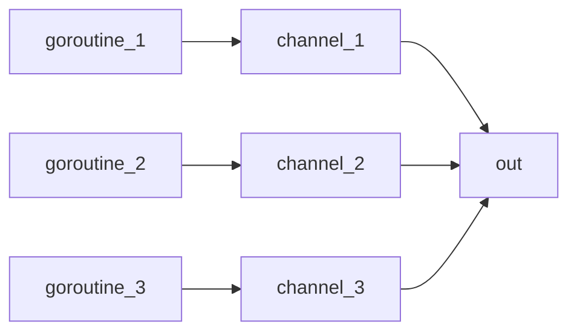
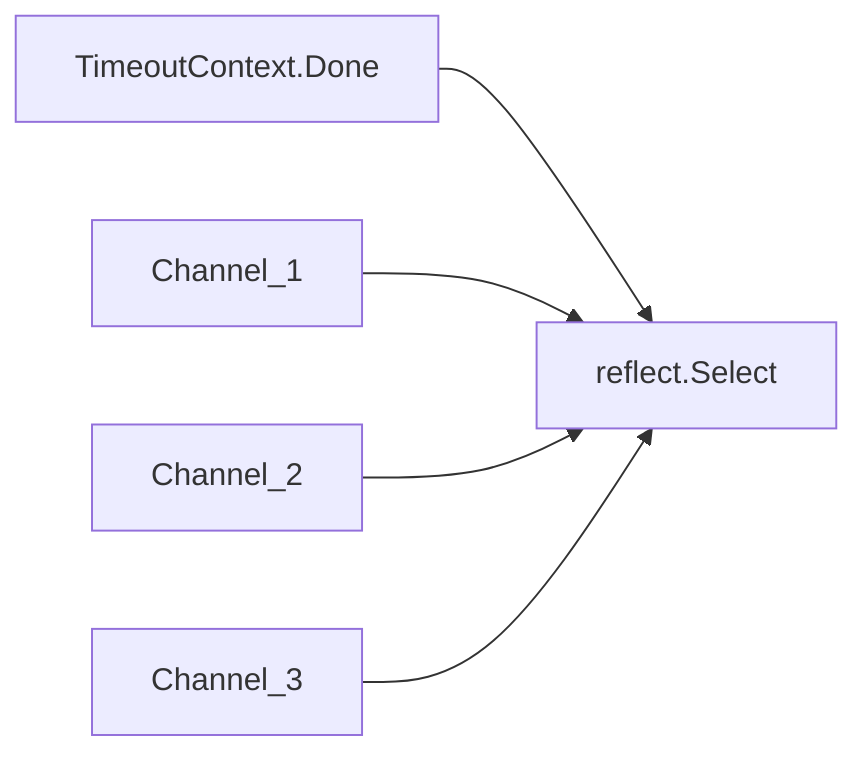

# 13 Context

<!-- @import "[TOC]" {cmd="toc" depthFrom=1 depthTo=3 orderedList=false} -->

<!-- code_chunk_output -->

- [13 Context](#13-context)
  - [0. 前言](#0-前言)
  - [1. Context 注意事項](#1-context-注意事項)
  - [2. Context 基本用法](#2-context-基本用法)
    - [2.1 Context Parent-Child 關係](#21-context-parent-child-關係)
  - [3. Context, Goroutine, reflect.Select for multiple channels](#3-context-goroutine-reflectselect-for-multiple-channels)
    - [3.1 資料匯流](#31-資料匯流)
    - [3.2 Channel 與 reflect.Select](#32-channel-與-reflectselect)
    - [3.3 Sample Code](#33-sample-code)

<!-- /code_chunk_output -->

## 0. 前言

`context` package 主要用在 goroutine 或 API 間的溝通。主要有兩個 root context：

1. `context.TODO()`
1. `context.Background()`

及四個 function：

1. `WithCancel(parent Context)`
1. `WithDeadline(parent Context, d time.Time)`
1. `WithTimeout(parent Context, timeout time.Duration)`
1. `WithValue(parent Context, key, val interface{})`

可以使用 `.Done()` 取得 channel，並讀取 channel，讓程式停住 (Block)，等待 context 被取消 (呼叫 cancel，或 timeout, deadline 到)。

## 1. Context 注意事項

>Package context defines the Context type, which carries deadlines, cancelation signals, and other request-scoped values across API boundaries and between processes.

`Context` 間有從屬關係，當父 context 被取消時，child context 也一併會取消。`WithCancel`, `WithDeadline`, `WithTimeout` 都會回傳 cancel function。即使原本的 context 已經被取消(可能是程式主動取消，或者被父 context 取消)，一定要呼叫該 context 的 cancel function.

>Even though ctx will be expired, it is good practice to call its cancelation function in any case.

使用 context 時，請依循以下規則([官方規則](https://golang.org/pkg/context/))

1. 不要在 struct 內，宣告變數存 `Context`，而是要透過 function 的參數傳遞，並且是該 function 的第一個參數, 命名為 `ctx`。eg:

	```go {.line-numbers}
	func DoSomething(ctx context.Context, arg Arg) error {
		// ... use ctx ...
	}
	```

1. 不要傳 nil Context 給 function。如果還不確定要做什麼功能時，可用 `context.TODO()` 或 `context.Background()`。
1. Context (`context.withValue`) 只能做 request-socped[^request-scoped] 使用，不要將函式需要的參數值，放在裏面。
1. 可以在不同的 goroutine 中共用同一個 Context。(Thread-Safe)

[^request-scoped]: 類似 JAVA Servlet 中 `ServletRuquest.GetAttribute` 及 `ServletRequest.SetAttribute`，當請求結束後，在 Attribute 的資料也被消滅了。

## 2. Context 基本用法

@import "ex13_01/main.go" {class="line-numbers"}

結果：

```text
2020/01/16 14:18:41 [Timeout Context] has dealine: 2020-01-16 14:18:44
2020/01/16 14:18:41 [Canncel Context] does not have dealine
2020/01/16 14:18:41 [Deadline Context] has dealine: 2020-01-16 14:18:51
2020/01/16 14:18:44 timeout ...
2020/01/16 14:18:44 cancel error: <nil>
2020/01/16 14:18:44 canncel...
2020/01/16 14:18:44 cancel error: context canceled
2020/01/16 14:18:44 The cancel context has been cancelled...
2020/01/16 14:18:51 The deadline context has been cancelled...
```

1. 使用 `.Done` 來等待 context 回應。
1. 可使用回傳的 cancel 函式，取消 context。

### 2.1 Context Parent-Child 關係

@import "ex13_02/main.go" {class="line-numbers"}

結果：

```text
2020/01/16 14:17:24 cancel 1
2020/01/16 14:17:24 ctx1: context canceled
2020/01/16 14:17:24 ctx2: context canceled
2020/01/16 14:17:24 end
2020/01/16 14:17:24 cancel 2
```

1. 當 `ctx1` 的 cancel function `cancel1` 被呼叫時，child `ctx2` 也會一併被取消
1. 即使 `ctx2` 已經被取消了，也記得呼叫 `ctx2` 的 cancel function `cancel2`。

## 3. Context, Goroutine, reflect.Select for multiple channels

以下的程式，摸擬有多個 channel 一直接受資料，再匯流到一個 channel 來讀取。當發生 timeout (5 sec.) 時，結果程式。主要是練習 `context` 及 `reflect.Select`。

### 3.1 資料匯流



### 3.2 Channel 與 reflect.Select



### 3.3 Sample Code

@import "ex13_03/main.go" {class="line-numbers"}

1. 可用使用 `reflect.Select` 及 `reflect.SelectCase` 來控制不固定數量的 channel。請見 `ReadAll`.
	1. `i, v, ok := reflect.Select(cases)`: 如果其中有一個 channel 被關閉時，v 會是 zero-value, ok 會是 `false`
1. 當 `timeout` Context 發生 timeout 時，`reflect.Select` 會接到，然後結束 goroutine.
