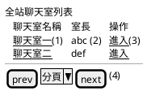
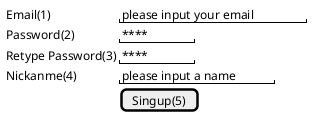
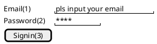
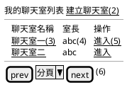
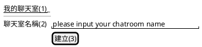
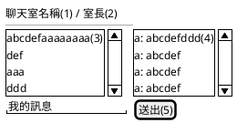

# Chatroom

<!-- @import "[TOC]" {cmd="toc" depthFrom=1 depthTo=3} -->

<!-- code_chunk_output -->

- [Chatroom](#chatroom)
  - [0. 前言](#0-前言)
  - [1. 相關文件](#1-相關文件)
  - [2. 功能說明](#2-功能說明)
    - [2.1 聊天室列表](#21-聊天室列表)
    - [2.2 會員註冊](#22-會員註冊)
    - [2.3 會員登入](#23-會員登入)
    - [2.4 我的聊天室](#24-我的聊天室)
    - [2.5 建立聊天室](#25-建立聊天室)
    - [2.6 聊天室](#26-聊天室)

<!-- /code_chunk_output -->

## 0. 前言

透過撰寫聊天室小專案，來練習 Go 相關技術。

## 1. 相關文件

- [Go](https://github.com/kigichang/go_course)
	- 一、Go 基礎說明
	- 二、多執行緒
	- 三、實作應用
		- 15 flag and spf13 Cobra/Viper 與 Gorilla 的部分，可以先跳過。
- [Docker](https://github.com/kigichang/docker_note)
- Websocket 或聊天室，可參考 [gorilla/websocket](https://www.gorillatoolkit.org/)
- 目前系統使用：[Echo](https://echo.labstack.com/)

## 2. 功能說明

程式撰寫需求：

1. 使用 Echo 框架
1. 使用 Websocket 技術，實作聊天室通訊。
1. 使用 Docker 架設 MySQL
1. 使用 Docket 佈署作業

### 2.1 聊天室列表

全站已建立的聊天室列表。畫面示意如下：

1. 聊天室名稱欄位: 顯示聊天室名稱，點擊連結後，另開視窗進入聊天室聊天畫面。
1. 室長欄位: 顯示建立聊天室帳號的 nickname。
1. 操作欄位: 點擊 <u>進入</u>，另開視窗進入聊天室聊天畫面。
1. 分頁 bar: 一頁只顯示 10 筆。以建立時間排序，優先排最近建立的聊天室。

### 2.2 會員註冊

畫面示意如下：

欄位說明:

1. Email: 請使用者輸入 email 帳號，需檢查 email 格式, 必填，如果 email 已經被使用過，需提示已註冊。
1. Password: 至少 8 碼，需有英文大小寫與數字混用，至少要有一個英文字母與數字。
1. Retype Password: 註冊前，需檢查是否與 Password 相同。
1. Nickname: 至少 4 字元以上，中文字算一個字元，如果 nickname 已經被用過，需提示已被使用。
1. Signup: 註冊前，需依上述檢查上述限制。

### 2.3 會員登入

畫面示意如下：

1. Email: 先前會員註冊的 email, 必填，需檢查 email 格式。
1. Password: 先前會員使用的密碼。
1. Signin: 登入前，需檢查所有欄位是否正確，登入成功後，請進入我的聊天室列表。

### 2.4 我的聊天室

我的聊天室列表

1. 需檢查會員是否有登入，如果沒有，請進至登入畫面。
1. 點擊 <u>建立聊天室</u>，進入建立聊天室畫面。
1. 聊天室名稱欄位: 顯示聊天室名稱，點擊連結後，另開視窗進入聊天室聊天畫面。
1. 室長欄位: 顯示建立聊天室帳號的 nickname。
1. 操作欄位: 點擊 <u>進入</u>，另開視窗進入聊天室聊天畫面。
1. 分頁 bar: 一頁只顯示 10 筆，以建立時間排序，優先排最近建立的聊天室。

### 2.5 建立聊天室

建立聊天室，畫面示意如下：

1. 點擊 <u>我的聊天室</u> 連結後，回到我的聊天室畫面。
1. 聊天室名稱: 至少 4 個字元以上，一個中文字算一個字元。
1. 點擊建立且成功後，回到我的聊天室畫面。

### 2.6 聊天室

使用者進入聊天室聊天畫面，示意圖如下：

1. 顯示聊天室名稱。
1. 顯示室長 nickname。
1. 成員框：顯示已經進入聊天室的成員，顯示該成員的 nickname。
1. 訊息框：顯示聊天訊息。格式是 nickname: 訊息。
1. 點擊 __送出__ 按鈕時，先檢查有無輸入訊息，如果沒有，則不做任何動作。有則顯示在 (4) 訊息框。

