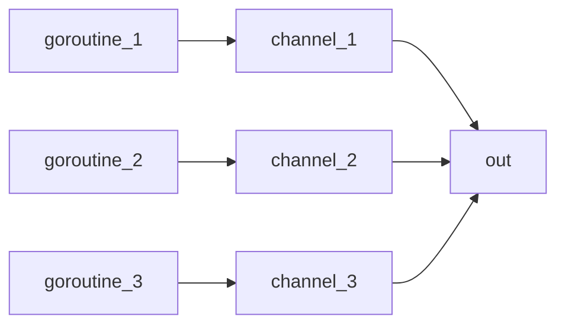
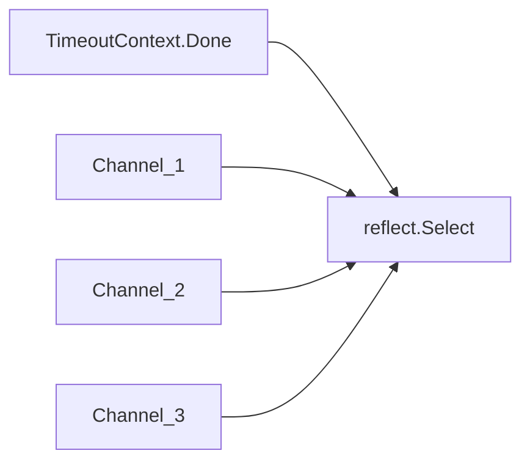

# 11 Concurrency - Goroutine and Channel

此章節的資料，來自 [Go Systems Programming](https://www.packtpub.com/networking-and-servers/go-systems-programming)

## goroutine

1. A **goroutine** is the minimum Go entity that can be executed concurrently
1. goroutine is live in **Thread**, so it is not an autonomous entity
1. 當主程式結束時，goroutine 也一併會結束，即使還沒執行完畢。

使用 `go` 這個關鍵字來啟動一個 goroutine.

```go {.line-numbers}
package main

import (
    "log"
    "time"
)

func namedFunction() {
    time.Sleep(3 * time.Second)
    log.Println("Printing from namedFunction!")
}

func main() {
    go namedFunction()

    time.Sleep(5 * time.Second)
    log.Println("Exiting....")
}
```

說明：

1. 先定義一組 function，之後要用 goroutine 來執行。function 故意延遲 3 秒。

    ```go {.line-numbers}
    func namedFunction() {
        time.Sleep(3 * time.Second)
        log.Println("Printing from namedFunction!")
    }
    ```

1. `go namedFunction()`: 產生一個 goroutine 來執行 `namedFunction()`
1. 主程式故意延遲 5 秒。否則 goroutine 會來不及執行。
1. 也可用 anonymous function

    ```go {.line-numbers}
    package main

    import (
        "log"
        "time"
    )

    func main() {
        go func() {
            time.Sleep(3 * time.Second)
            log.Println("Printing from anonymous")
        }()

        time.Sleep(5 * time.Second)
        log.Println("Exiting....")
    }
    ```

### Wait for goroutine

可以利用 `sync.WaitGroup` 來等待 goroutine 結束。

1. 已知有幾個 goroutine 會被執行

    ```go {.line-numbers}
    package main

    import (
        "log"
        "sync"
        "time"
    )

    func main() {
        waitGroup := &sync.WaitGroup{}

        waitGroup.Add(10)

        for i := 0; i < 10; i++ {
            go func(x int) {
                defer waitGroup.Done()
                time.Sleep(100 * time.Millisecond)
                log.Printf("%d ", x)
            }(i)
        }

        waitGroup.Wait()
        log.Println("Exit....")
    }
    ```

    說明：

    - `waitGroup := &sync.WaitGroup{}`: 產生一個 wait group
    - `waitGroup.Add(10)`: 告知 wait group 要等幾個 goroutine。
    - 產生 10 個 goroutine，並 `defer waitGroup.Done()`，確保 function 結束後，會告知 wait group 有 goroutine 結束了。

        ```go {.line-numbers}
        for i := 0; i < 10; i++ {
            go func(x int) {
                defer waitGroup.Done()
                time.Sleep(100 * time.Millisecond)
                fmt.Printf("%d ", x)
            }(i)
        }
        ```

    - `waitGroup.Wait()`: 主程序 wait

    也可以每需要一個 goroutine 時，wait group 就加 1。記得 `waitGroup.Add(1)` 要在 `go nameFunction()` 之前。

1. 每執行 goroutine 前，WaitGroup Counter + 1

    ```go {.line-numbers}
    package main

    import (
        "log"
        "sync"
        "time"
    )

    func test(x int, wait *sync.WaitGroup) {
        log.Println(x, "start")
        defer wait.Done()

        time.Sleep(5 * time.Second)
        log.Println(x, "end")

    }

    func main() {

        log.Println("Start...")
        wg := &sync.WaitGroup{}

        wg.Add(1)

        go test(10, wg)

        wg.Add(1)

        go test(11, wg)

        wg.Add(1)

        go test(12, wg)

        wg.Wait()
        log.Println("Exit....")
    }
    ```

### Go Routine Puzzlers

Puzzlers Example 1:

```go {.line-numbers}
package main

import (
    "fmt"
    "sync"
)

type Test struct {
    ID int
}

func main() {
    var tests []Test
    for i := 0; i < 2; i++ {
        tests = append(tests, Test{i})
    }

    wait := sync.WaitGroup{}

    for _, x := range tests {
        wait.Add(1)
        go func(t *Test) {
            defer wait.Done()
            fmt.Println(t.ID)
        }(&x)
        fmt.Println(i, x, "end")
        //time.Sleep(1 * time.Second) // 故意 sleep。讓 goroutine 先執行。
    }

    wait.Wait()

}
```

結果：

```text
1
1
```

修正:

Puzzlers Example 2:

```go {.line-numbers}
package main

import (
    "fmt"
    "sync"
)

type Test struct {
    ID int
}

func main() {
    var tests []Test
    for i := 0; i < 2; i++ {
        tests = append(tests, Test{i})
    }

    wait := sync.WaitGroup{}

    for i, _ := range tests {
        wait.Add(1)
        go func(t *Test) {
            defer wait.Done()
            fmt.Println(t.ID)
        }(&tests[i])

    }

    wait.Wait()

}
```

結果：

```text
1
0
```

因為 goroutine 會需要時間做初始化，所以在 Loop 的宣告的 goroutine, 有很大的機會會在 Loop 結束後，才執行。因此在 closure binding 時，會有很大的機會會 binding 到最後一個值。在 Puzzlers Example 1 中，最後 `x` binding 的值會是最後一個。

建議有這種情形時，要明確指定值。

## channel

Channel 可以想像是一個資料的通道 (pipe)，一頭是 write，另一頭是 read，資料順序是 FIFO (First In First Out)。通常用在 goroutine 間資料交換。channel 是 thread-safe，因此可以同時讀寫 channel。

channel 的注意事項：

1. 用 `make` 與 `chan` 關鍵字來產生一個 channel，不用時，要用 `close` 關閉。
1. 一個 channel 只能包含一種 data type
1. channel 當作參數傳給 function 時，最好指定是要做 read or write。

eg:<a name="channel_with_goroutine"></a>

```go {.line-numbers}
package main

import (
    "log"
    "sync"
)

var (
    waitGroup = sync.WaitGroup{}
)

func writeChannel(c chan<- int, x int) {
    defer waitGroup.Done()

    log.Println("writing ", x)
    c <- x
    log.Println("written ", x)
}

func readChannel(c <-chan int) {
    log.Println("reading from channel")
    defer waitGroup.Done()
    x := <-c
    log.Println("read: ", x)
}

func main() {
    c := make(chan int)
    defer close(c)

    waitGroup.Add(1)
    go readChannel(c)

    waitGroup.Add(1)
    go writeChannel(c, 10)

    waitGroup.Wait()
    log.Println("exit...")
}
```

說明：

1. `c := make(chan int)`: 產生一個 channel 且 data type 是 `int`。並 `defer close(c)` 確保 channel 會被關閉。
1. `go readChannel(c)`: goroutine 執行 readChannel。

    ```go {.line-numbers}
    func readChannel(c <-chan int) {
        log.Println("reading from channel")
        defer waitGroup.Done()
        x := <-c
        log.Println("read: ", x)
    }
    ```

    注意: `c <-chan`，是 **read only** channel

1. `go writeChannel(c, 10)`: goroutine 執行 writeChannel。

    ```go {.line-numbers}
    func writeChannel(c chan<- int, x int) {
        defer waitGroup.Done()

        log.Println("writing ", x)
        c <- x
        log.Println("wrote ", x)
    }
    ```

    注意：`c chan<- int` 是 **write only** channel。

### Buffered Channel

`c := make(chan int)` 宣告時，沒有指定 channel 的容量，因此在 read/write 時，會 block。在[上一例](#channel_with_goroutine)中，因為是用 goroutine 執行, 所以不會有問題。

eg:

```go {.line-numbers}
package main

import (
    "log"
)

func main() {
    c := make(chan int)
    defer close(c)

    log.Println("writing...")

    c <- 10

    log.Println("written")

    log.Println("reading")

    x := <-c

    log.Println("read ", x)

    log.Println("exit...")
}
```

執行結果，發生 deadlock：

```text
2018/01/24 16:05:25 writing...
fatal error: all goroutines are asleep - deadlock!

goroutine 1 [chan send]:
main.main()
        /Users/kigi/Data/go/src/go_test/class13-1/main.go:32 +0xd6
exit status 2
```

此時，可以設定 channel 的容量，eg: `c := make(chan int, 1)`。則結果如下：

```text
2018/01/24 16:08:08 writing...
2018/01/24 16:08:08 written
2018/01/24 16:08:08 reading
2018/01/24 16:08:08 read  10
2018/01/24 16:08:08 exit...
```

先執 write，資料放在 channel，供之後 read。但如果程式的順序，改成先 read 再 write 時，一樣會發生 deadlock。因為還沒寫資料，根本沒資料供 read。

eg:

```go {.line-numbers}
func main() {
    c := make(chan int, 1)
    defer close(c)

    log.Println("reading")

    x := <-c

    log.Println("read ", x)

    log.Println("writing...")

    c <- 10

    log.Println("written")

    log.Println("exit...")
}
```

結果：

```text
2018/01/24 16:10:51 reading
fatal error: all goroutines are asleep - deadlock!

goroutine 1 [chan receive]:
main.main()
        /Users/kigi/Data/go/src/go_test/class13-1/main.go:32 +0xdd
```

### Producer and Consumer Pattern (Pipeline)

Producer/Consumer 是 channel 最常用的實作模型。概念是一端產出資料 (可能是從資料庫或大檔案讀取資料)，另一端運算資料。

eg 利用 goroutine 執行 1 個 producer 及 2 個 consumer:

```go {.line-numbers}
package main

import (
    "log"
    "sync"
)

var (
    waitGroup = sync.WaitGroup{}
)

func producer(min, max int, c chan<- int) {
    defer waitGroup.Done()
    log.Println("producer start...")
    for i := min; i < max; i++ {
        c <- i
    }
    close(c)
    log.Println("producer end and close channel")
}

func consumer(x int, c <-chan int) {
    defer waitGroup.Done()
    count := 0

    log.Println("comsumer ", x, " starting...")
    for a := range c {
        log.Println(x, " got ", a)
        count++
    }
    log.Printf("consumer %d got %d times and end\n", x, count)
}

func main() {
    log.Println("start...")
    c := make(chan int)

    waitGroup.Add(1)
    go producer(1, 100, c)

    waitGroup.Add(1)
    go consumer(1, c)

    waitGroup.Add(1)
    go consumer(2, c)

    waitGroup.Wait()
    log.Println("end")
}
```

與先前的範例最大不同是，這次關閉 channel 是在 `producer` 執行，而非主程序，也就是說在產生完資料後，就關閉 channel，之後就不能再寫入。而 `consumer` 端，在 channel 資料讀完後，就會跳出 for-range 的迴圈而執行完畢。

如果不在 `producer` 關閉 channel，而是在主程序，則會發生 deadlock。

eg:

```go {.line-numbers}
func producer(min, max int, c chan<- int) {
    defer waitGroup.Done()
    log.Println("producer start...")
    for i := min; i < max; i++ {
        c <- i
    }
    //close(c)
    log.Println("producer end and close channel")
}

func main() {
    log.Println("start...")
    c := make(chan int)
    defer close(c)              // 主程序關閉 channel
    waitGroup.Add(1)
    go producer(1, 100, c)

    waitGroup.Add(1)
    go consumer(1, c)

    waitGroup.Add(1)
    go consumer(2, c)

    waitGroup.Wait()
    log.Println("end")
}
```

結果：

```text
2018/01/24 16:46:15 start...
2018/01/24 16:46:15 comsumer  2  starting...
2018/01/24 16:46:15 comsumer  1  starting...
2018/01/24 16:46:15 producer start...
2018/01/24 16:46:15 1  got  2
...
2018/01/24 16:46:15 1  got  99
2018/01/24 16:46:15 producer end and close channel
fatal error: all goroutines are asleep - deadlock!

goroutine 1 [semacquire]:
sync.runtime_Semacquire(0x11618ac)
        /usr/local/go/src/runtime/sema.go:56 +0x39
sync.(*WaitGroup).Wait(0x11618a0)
        /usr/local/go/src/sync/waitgroup.go:131 +0x72
main.main()
        /Users/kigi/Data/go/src/go_test/class13-1/main.go:63 +0x193

goroutine 6 [chan receive]:
main.consumer(0x1, 0xc420072060)
        /Users/kigi/Data/go/src/go_test/class13-1/main.go:43 +0x237
created by main.main
        /Users/kigi/Data/go/src/go_test/class13-1/main.go:58 +0x13f

goroutine 7 [chan receive]:
main.consumer(0x2, 0xc420072060)
        /Users/kigi/Data/go/src/go_test/class13-1/main.go:43 +0x237
created by main.main
        /Users/kigi/Data/go/src/go_test/class13-1/main.go:61 +0x183
exit status 2
```

### Actor Pattern (Pipeline)

Actor Pattern 與 Producer/Consumer Pattern 類似，概念是每一個 Actor 只負責固定的工作。Producer 必須將資料，傳到每個 Actor。以下的範例，是模擬訂單成立後，傳給兩個 Actor，一個負責計算每個分類的業績，另一個計算全站的業績。

eg:

```go {.line-numbers}
package main

import (
    "fmt"
    "log"
    "sync"
)

var (
    waitGroup = sync.WaitGroup{}
)

// Data ...
type Order struct {
    Category string
    Amount   float64
}

// Actor ...
type Actor interface {
    Run()
}

// Producer ...
type Producer struct {
    MailBoxes []chan Order
}

// Run ...
func (p *Producer) Run() {
    defer waitGroup.Done()

    for i := 0; i < 100; i++ {
        category := fmt.Sprintf("cate-%d", i%7)
        amount := float64(i)

        order := Order{
            Category: category,
            Amount:   amount,
        }

        for _, m := range p.MailBoxes {
            m <- order
        }
    }

    for _, m := range p.MailBoxes {
        close(m)
    }
}

// CategorySum ...
type CategorySum struct {
    MailBox     chan Order
    CategorySum map[string]float64
}

// Run ...
func (c *CategorySum) Run() {
    defer waitGroup.Done()

    for order := range c.MailBox {
        c.CategorySum[order.Category] += order.Amount
    }
}

// SiteSum ...
type SiteSum struct {
    MailBox chan Order
    Total   float64
}

// Run ...
func (c *SiteSum) Run() {
    defer waitGroup.Done()

    for order := range c.MailBox {
        c.Total += order.Amount
    }
}

func main() {
    log.Println("start...")

    producer := &Producer{}
    waitGroup.Add(1)

    category := &CategorySum{
        MailBox:     make(chan Order),
        CategorySum: make(map[string]float64),
    }
    waitGroup.Add(1)
    producer.MailBoxes = append(producer.MailBoxes, category.MailBox)

    site := &SiteSum{
        MailBox: make(chan Order),
    }
    waitGroup.Add(1)
    producer.MailBoxes = append(producer.MailBoxes, site.MailBox)

    go producer.Run()
    go category.Run()
    go site.Run()

    waitGroup.Wait()

    total := 0.0

    for x, a := range category.CategorySum {
        log.Println(x, ":", a)
        total += a
    }

    log.Println("total: ", site.Total, total)

    log.Println("end")
}
```

說明：

1. `Producer`: 負責模擬產生 100 筆訂單後，往後送給 consumer actor 處理。最後再關閉 consumer actor 的 channel，讓程式可以執行完畢。
1. `CategorySum`: 負責主要統計每個分類的業績。
1. `SiteSum`: 負責統計全站業績

## Select and Timeout

可以透過 `select` 來偵測 channel 是否可以被寫入及是否有資料可以讀取。`select` 可以撘配 `time.After` 來實作 timeout 的機制。

eg:

```go {.line-numbers}
package main

import (
    "log"
    "math/rand"
    "time"
)

func createNumber(max int, randomChannel chan<- int, finishChannel <-chan bool) {
    for {
        select {
        case randomChannel <- rand.Intn(max):
            time.Sleep(1 * time.Second)
        case x := <-finishChannel:
            log.Println("finish channel got ", x)
            if x {
                close(randomChannel)
                log.Println("createNumber end")
                return
            }
        }
    }

}

func readNumber(randomChannel <-chan int) {
    for {
        select {
        case x, ok := <-randomChannel:
            if !ok {
                log.Println("readNumber end")
                return
            }
            log.Println("random channel got ", x)
        case <-time.After(500 * time.Millisecond):
            log.Println("time out")
        }
    }
}

func main() {
    rand.Seed(time.Now().Unix())

    randomChannel := make(chan int)
    finishChannel := make(chan bool)

    go createNumber(100, randomChannel, finishChannel)
    go readNumber(randomChannel)

    time.Sleep(2 * time.Second)
    finishChannel <- false
    time.Sleep(3 * time.Second)
    finishChannel <- true
    time.Sleep(1 * time.Second)
    close(finishChannel)
    log.Println("end")

}
```

### 說明

#### createNumber

1. `for { }`: 無窮迴圈
1. `select - case`: 使用 `select` 來偵測 channel 狀態。
1. `case randomChannel <- rand.Intn(max)`: 對 `randomChannel` 寫入資料
1. `x := <-finishChannel`: 從 `finishChannel` 讀取資料，如果為 `true` 則關閉 `randomChannel` 並結束 `select - case` 迴圈。

#### readNumber

1. `for { }`: 無窮迴圈
1. `select - case`: 使用 `select` 來偵測 channel 狀態。
1. `case x, ok := <-randomChannel`: 從 `randomChannel` 讀取資料，這邊與先前從 channel 讀資料不同，多了一個 `ok` 來判斷 channel 是否已經被關閉了。如果 `randomChannel` 已被關閉，則跳出迴圈。
1. `case <-time.After(500 * time.Millisecond)`: Timeout 機制，如果 500 ms  內，randomChannel 一直沒有資料寫入的話，則會觸發。

#### main

1. 初始化 channel 及 goroutine.
1. 先停 2 sec. 後，先對 `finishChannel` 寫入 `false`，此時不會中止所有活動，但 `finishChannel` 會得到一個 `false` 值。
1. 再停 3 sec. 後，再對 `finishChannel` 寫入 `true`，此時會中斷 `createNumber` 的迴圈，且 `randomChannel` 會被關閉。
1. `randomChannel` 被關閉後，`readNumber` 會偵測到 `randomChannel` 被關閉，而中斷 `readNumber` 迴圈。
1. 再停 1 sec. 關閉 `finishChannel`。

#### 執行結果

```text
2018/01/29 15:42:14 random channel got  13
2018/01/29 15:42:14 time out
2018/01/29 15:42:15 random channel got  14
2018/01/29 15:42:15 time out
2018/01/29 15:42:16 finish channel got  false
2018/01/29 15:42:16 random channel got  19
2018/01/29 15:42:16 time out
2018/01/29 15:42:17 random channel got  97
2018/01/29 15:42:17 time out
2018/01/29 15:42:18 random channel got  61
2018/01/29 15:42:18 time out
2018/01/29 15:42:19 random channel got  79
2018/01/29 15:42:19 time out
2018/01/29 15:42:20 random channel got  2
2018/01/29 15:42:20 time out
2018/01/29 15:42:21 finish channel got  true
2018/01/29 15:42:21 createNumber end
2018/01/29 15:42:21 readNumber end
2018/01/29 15:42:22 end
```

## Context

`context` package 主要用在 goroutine 或 API 間的溝通，主要有兩個 root context

1. `context.TODO()`
1. `context.Background()`

及四個 function

1. `WithCancel(parent Context)`
1. `WithDeadline(parent Context, d time.Time)`
1. `WithTimeout(parent Context, timeout time.Duration)`
1. `WithValue(parent Context, key, val interface{})`

>Package context defines the Context type, which carries deadlines, cancelation signals, and other request-scoped values across API boundaries and between processes.

`Context` 間有從屬關係，當父 context 被取消時，child context 也一併會取消。`WithCancel`, `WithDeadline`, `WithTimeout` 都會回傳 cancel function。即使原本的 context 已經被取消(可能是程式主動取消，或者被父 context 取消)，一定要呼叫該 context 的 cancel function.

>Even though ctx will be expired, it is good practice to call its cancelation function in any case.

使用 context 時，請依循以下規則([官方規則](https://golang.org/pkg/context/))

1. 不要在 struct 內，宣告變數存 `Context`，而是要透過 function 的參數傳遞，並且是該 function 的第一個參數, 命名為 `ctx`。eg:

    ```go {.line-numbers}
    func DoSomething(ctx context.Context, arg Arg) error {
        // ... use ctx ...
    }
    ```
1. 不要傳 nil Context 給 function。如果還不確定要做什麼功能時，可用`context.TODO()`。
1. 使用 Context 傳資料時 (`context.withValue`), 這個資料應是 request-socped[^request-scoped] 屬性的資料，不應該是選項類型的資料。

1. 可以在不同的 goroutine 中共用同一個 Context。(Thread-Safe)

[^request-scoped]: 類似 JAVA Servlet 中 `ServletRuquest.GetAttribute` 及 `ServletRequest.SetAttribute`，當請求結束後，在 Attribute 的資料也被消滅了。

### Context 基本用法

```go {.line-numbers}
package main

import (
    "context"
    "log"
    "time"
)

func contextDemo(ctx context.Context) {
    dealine, ok := ctx.Deadline()
    name := ctx.Value(contextKey("name"))

    if ok {
        log.Println(name, "has dealine:", dealine.Format("2006-01-02 15:04:05"))
    } else {
        log.Println(name, "does not have dealine")
    }
}

type contextKey string

func main() {
    timeout := 3 * time.Second
    deadline := time.Now().Add(10 * time.Second)

    timeoutContext, timeoutCancelFunc := context.WithTimeout(context.Background(), timeout)
    defer timeoutCancelFunc()

    cancelContext, cancelFunc := context.WithCancel(context.Background())

    deadlineContext, deadlineCancelFunc := context.WithDeadline(context.Background(), deadline)
    defer deadlineCancelFunc()

    go contextDemo(context.WithValue(timeoutContext, contextKey("name"), "[Timeout Context]"))
    go contextDemo(context.WithValue(cancelContext, contextKey("name"), "[Canncel Context]"))
    go contextDemo(context.WithValue(deadlineContext, contextKey("name"), "[Deadline Context]"))

    <-timeoutContext.Done()
    log.Println("timeout ...")

    log.Println("canncel...")
    cancelFunc()

    <-cancelContext.Done()
    log.Println("The cancel context has been cancelled...")

    log.Println("cancel error:", cancelContext.Err())

    <-deadlineContext.Done()
    log.Println("The deadline context has been cancelled...")
}
```

### Context Parent-Child 關係

```go {.line-numbers}
package main

import (
    "context"
    "log"
    "time"
)

func main() {
    ctx1, cancel1 := context.WithCancel(context.Background())
    ctx2, cancel2 := context.WithTimeout(ctx1, 10*time.Second)
    defer func() {
        log.Println("cancel 2")
        cancel2()
    }()

    <-time.After(2 * time.Second)
    log.Println("cancel 1")
    cancel1()
    log.Println("ctx1:", ctx1.Err())
    log.Println("ctx2:", ctx2.Err())
    log.Println("end")
}
```

**說明**:

1. 當 `ctx1` 的 cancel function `cancel1` 被呼叫時，child `ctx2` 也會一併被取消
1. 即使 `ctx2` 已經被取消了，也記得呼叫 `ctx2` 的 cancel function `cancel2`。

### Context, Goroutine, reflect.Select for multiple channels

以下的程式，摸擬有多個 channel 一直接受資料，再匯流到一個 channel 來讀取。當發生 timeout (5 sec.) 時，結果程式。主要是練習 `context` 及 `reflect.Select`。

**資料匯流**:



**channel 與 relect.Select**:



sample code:

```go {.line-numbers}
package main

import (
    "context"
    "fmt"
    "log"
    "reflect"
    "sync"
    "time"
)

// ReadAll redirect channels to one out channel
func ReadAll(ctx context.Context, wait *sync.WaitGroup, channels ...chan interface{}) <-chan interface{} {
    out := make(chan interface{})

    var cases []reflect.SelectCase
    cases = append(cases, reflect.SelectCase{
        Dir:  reflect.SelectRecv,
        Chan: reflect.ValueOf(ctx.Done()),
    })

    for _, c := range channels {
        cases = append(cases, reflect.SelectCase{
            Dir:  reflect.SelectRecv,
            Chan: reflect.ValueOf(c),
        })
    }

    go func() {
        defer func() {
            close(out)
            wait.Done()
            log.Println("close out and done")
        }()

        for len(cases) > 1 {
            i, v, ok := reflect.Select(cases)
            log.Println(i, v, ok)
            if i == 0 { // timeout and exit
                log.Println("cancel !!!")
                return
            }
            if !ok { // some channel is closed and remove from cases
                cases = append(cases[:i], cases[i+1:]...)
            }

            out <- v.Interface()
        }
    }()

    return out
}

func main() {
    channels := []chan interface{}{
        make(chan interface{}),
        make(chan interface{}),
        make(chan interface{}),
    }

    defer func() {
        for _, c := range channels {
            close(c)
        }
        log.Println("close channels completed")
    }()

    timeout, cancel := context.WithTimeout(context.Background(), 5*time.Second)
    defer func() {
        cancel()
        log.Println("cancel context")
    }()
    wait := sync.WaitGroup{}
    wait.Add(1)
    out := ReadAll(timeout, &wait, channels...)

    // generate goroutines for each channel to write data
    for i, c := range channels {
        go func(a int, c chan<- interface{}) {
            for {
                <-time.After(time.Second)
                c <- fmt.Sprintf("%d:%s", a, time.Now().Format("2006-01-02 15:04:05"))
            }
        }(i, c)
    }

    // generate goroutine to read data from out channel
    go func() {
        for x := range out {
            log.Println("out got:", x)
        }
    }()

    // wait for goroutine in ReadAll
    wait.Wait()
    log.Println("end")

}
```

**說明**:

1. 可用使用 `reflect.Select` 及 `reflect.SelectCase` 來控制不固定數量的 channel。請見 `ReadAll`.
    1. `i, v, ok := reflect.Select(cases)`: 如果其中有一個 channel 被關閉時，v 會是 zero-value, ok 會是 `false`
1. 當 `timeout` Context 發生 timeout 時，`reflect.Select` 會接到，然後結束 goroutine.