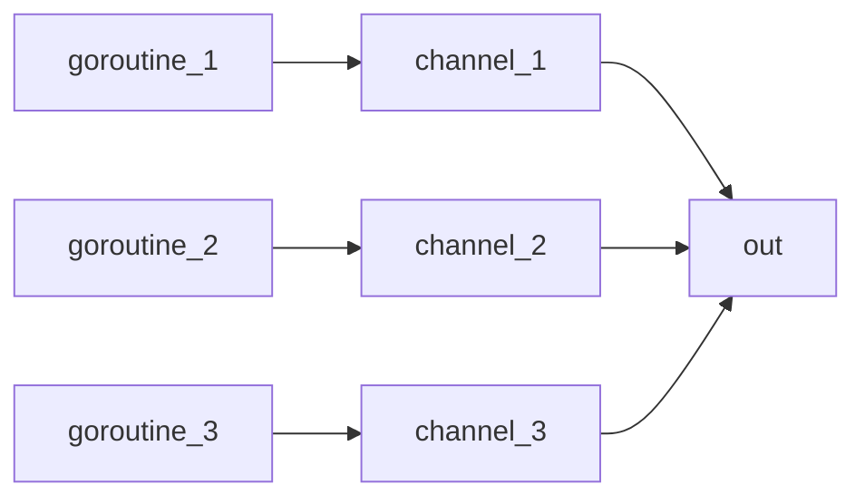
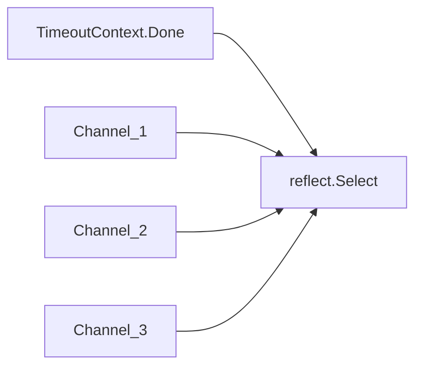

# 13 Context

`context` package 主要用在 goroutine 或 API 間的溝通，主要有兩個 root context：

1. `context.TODO()`
1. `context.Background()`

及四個 function：

1. `WithCancel(parent Context)`
1. `WithDeadline(parent Context, d time.Time)`
1. `WithTimeout(parent Context, timeout time.Duration)`
1. `WithValue(parent Context, key, val interface{})`

可以使用 `.Done()` 取得 channel，並讀取 channel，讓程式停住 (Block)，等待 context 被取消 (呼叫 cancel，或 timeout, deadline 到)。

## Context 注意事項

>Package context defines the Context type, which carries deadlines, cancelation signals, and other request-scoped values across API boundaries and between processes.

`Context` 間有從屬關係，當父 context 被取消時，child context 也一併會取消。`WithCancel`, `WithDeadline`, `WithTimeout` 都會回傳 cancel function。即使原本的 context 已經被取消(可能是程式主動取消，或者被父 context 取消)，一定要呼叫該 context 的 cancel function.

>Even though ctx will be expired, it is good practice to call its cancelation function in any case.

使用 context 時，請依循以下規則([官方規則](https://golang.org/pkg/context/))

1. 不要在 struct 內，宣告變數存 `Context`，而是要透過 function 的參數傳遞，並且是該 function 的第一個參數, 命名為 `ctx`。eg:

    ```go {.line-numbers}
    func DoSomething(ctx context.Context, arg Arg) error {
        // ... use ctx ...
    }
    ```

1. 不要傳 nil Context 給 function。如果還不確定要做什麼功能時，可用`context.TODO()`。
1. Context (`context.withValue`) 只能做 request-socped[^request-scoped] 使用，不做類似選項資料傳入函式。
1. 可以在不同的 goroutine 中共用同一個 Context。(Thread-Safe)

[^request-scoped]: 類似 JAVA Servlet 中 `ServletRuquest.GetAttribute` 及 `ServletRequest.SetAttribute`，當請求結束後，在 Attribute 的資料也被消滅了。

## Context 基本用法

```go {.line-numbers}
package main

import (
    "context"
    "log"
    "time"
)

func contextDemo(ctx context.Context) {
    dealine, ok := ctx.Deadline()
    name := ctx.Value(contextKey("name"))

    if ok {
        log.Println(name, "has dealine:", dealine.Format("2006-01-02 15:04:05"))
    } else {
        log.Println(name, "does not have dealine")
    }
}

type contextKey string

func main() {
    timeout := 3 * time.Second
    deadline := time.Now().Add(10 * time.Second)

    timeoutContext, timeoutCancelFunc := context.WithTimeout(context.Background(), timeout)
    defer timeoutCancelFunc()

    cancelContext, cancelFunc := context.WithCancel(context.Background())

    deadlineContext, deadlineCancelFunc := context.WithDeadline(context.Background(), deadline)
    defer deadlineCancelFunc()

    contextDemo(context.WithValue(timeoutContext, contextKey("name"), "[Timeout Context]"))
    contextDemo(context.WithValue(cancelContext, contextKey("name"), "[Canncel Context]"))
    contextDemo(context.WithValue(deadlineContext, contextKey("name"), "[Deadline Context]"))

    <-timeoutContext.Done()
    log.Println("timeout ...")

    log.Println("cancel error:", cancelContext.Err())
    log.Println("canncel...")
    cancelFunc()
    log.Println("cancel error:", cancelContext.Err())

    <-cancelContext.Done()
    log.Println("The cancel context has been cancelled...")

    <-deadlineContext.Done()
    log.Println("The deadline context has been cancelled...")
}
```

結果：

```text
2020/01/16 14:18:41 [Timeout Context] has dealine: 2020-01-16 14:18:44
2020/01/16 14:18:41 [Canncel Context] does not have dealine
2020/01/16 14:18:41 [Deadline Context] has dealine: 2020-01-16 14:18:51
2020/01/16 14:18:44 timeout ...
2020/01/16 14:18:44 cancel error: <nil>
2020/01/16 14:18:44 canncel...
2020/01/16 14:18:44 cancel error: context canceled
2020/01/16 14:18:44 The cancel context has been cancelled...
2020/01/16 14:18:51 The deadline context has been cancelled...
```

說明：

1. 使用 `.Done` 來等待 context 回應。
1. 可使用回傳的 cancel 函式，取消 context。

### Context Parent-Child 關係

```go {.line-numbers}
package main

import (
    "context"
    "log"
    "time"
)

func main() {
    ctx1, cancel1 := context.WithCancel(context.Background())
    ctx2, cancel2 := context.WithTimeout(ctx1, 10*time.Second)
    defer func() {
        log.Println("cancel 2")
        cancel2()
    }()

    <-time.After(2 * time.Second)
    log.Println("cancel 1")
    cancel1()
    log.Println("ctx1:", ctx1.Err())
    log.Println("ctx2:", ctx2.Err())
    log.Println("end")
}
```

結果：

```text
2020/01/16 14:17:24 cancel 1
2020/01/16 14:17:24 ctx1: context canceled
2020/01/16 14:17:24 ctx2: context canceled
2020/01/16 14:17:24 end
2020/01/16 14:17:24 cancel 2
```

**說明**:

1. 當 `ctx1` 的 cancel function `cancel1` 被呼叫時，child `ctx2` 也會一併被取消
1. 即使 `ctx2` 已經被取消了，也記得呼叫 `ctx2` 的 cancel function `cancel2`。

## Context, Goroutine, reflect.Select for multiple channels

以下的程式，摸擬有多個 channel 一直接受資料，再匯流到一個 channel 來讀取。當發生 timeout (5 sec.) 時，結果程式。主要是練習 `context` 及 `reflect.Select`。

**資料匯流**:



**channel 與 relect.Select**:



sample code:

```go {.line-numbers}
package main

import (
    "context"
    "fmt"
    "log"
    "reflect"
    "sync"
    "time"
)

// ReadAll redirect channels to one out channel
func ReadAll(ctx context.Context, wait *sync.WaitGroup, channels ...chan interface{}) <-chan interface{} {
    out := make(chan interface{})

    var cases []reflect.SelectCase
    cases = append(cases, reflect.SelectCase{
        Dir:  reflect.SelectRecv,
        Chan: reflect.ValueOf(ctx.Done()),
    })

    for _, c := range channels {
        cases = append(cases, reflect.SelectCase{
            Dir:  reflect.SelectRecv,
            Chan: reflect.ValueOf(c),
        })
    }

    go func() {
        defer func() {
            close(out)
            wait.Done()
            log.Println("close out and done")
        }()

        for len(cases) > 1 {
            i, v, ok := reflect.Select(cases)
            log.Println(i, v, ok)
            if i == 0 { // timeout and exit
                log.Println("cancel !!!")
                return
            }
            if !ok { // some channel is closed and remove from cases
                cases = append(cases[:i], cases[i+1:]...)
            }

            out <- v.Interface()
        }
    }()

    return out
}

func main() {
    channels := []chan interface{}{
        make(chan interface{}),
        make(chan interface{}),
        make(chan interface{}),
    }

    defer func() {
        for _, c := range channels {
            close(c)
        }
        log.Println("close channels completed")
    }()

    timeout, cancel := context.WithTimeout(context.Background(), 5*time.Second)
    defer func() {
        cancel()
        log.Println("cancel context")
    }()
    wait := sync.WaitGroup{}
    wait.Add(1)
    out := ReadAll(timeout, &wait, channels...)

    // generate goroutines for each channel to write data
    for i, c := range channels {
        go func(a int, c chan<- interface{}) {
            for {
                <-time.After(time.Second)
                c <- fmt.Sprintf("%d:%s", a, time.Now().Format("2006-01-02 15:04:05"))
            }
        }(i, c)
    }

    // generate goroutine to read data from out channel
    go func() {
        for x := range out {
            log.Println("out got:", x)
        }
    }()

    // wait for goroutine in ReadAll
    wait.Wait()
    log.Println("end")

}
```

**說明**:

1. 可用使用 `reflect.Select` 及 `reflect.SelectCase` 來控制不固定數量的 channel。請見 `ReadAll`.
    1. `i, v, ok := reflect.Select(cases)`: 如果其中有一個 channel 被關閉時，v 會是 zero-value, ok 會是 `false`
1. 當 `timeout` Context 發生 timeout 時，`reflect.Select` 會接到，然後結束 goroutine.
