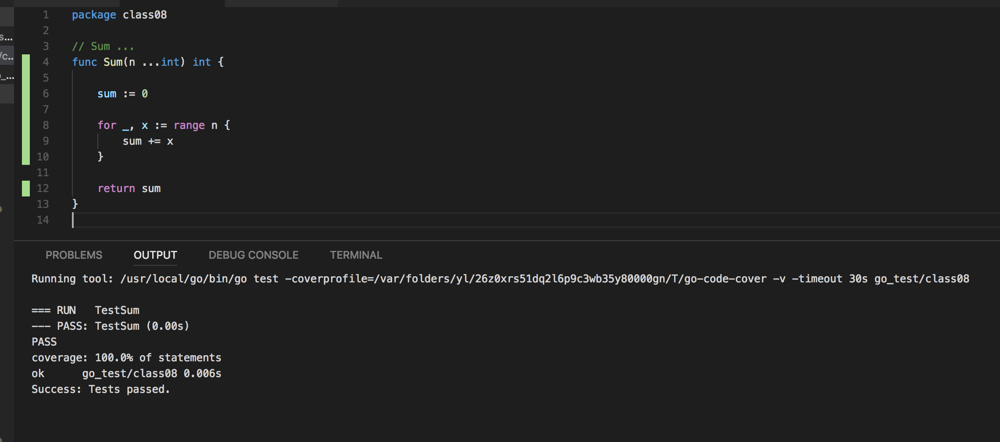

# 14 Testing

Go 有自帶一個 Unit Test 的工具包。程式寫作時，可以自動做 unit test。使用上的慣例：在當下的目錄下，為每一個程式檔案，再新增一個 xxx_test.go 的檔案，裏面撰寫 unit test 程式。

VSCode Go Plugins 設定：

```json
{
    "terminal.integrated.shell.osx": "/bin/zsh",
    "go.coverOnSave": true,
    "go.coverageDecorator": "gutter",
    "go.testFlags": ["-v"]
}
```

## 目錄與檔案

```text
.
├── util.go
└── util_test.go
```

測試 function 命名是以 **Test** 開頭，通常會針對要測試的 function 來命名，比如：有一個 `Sum` 的 function, 測試 `Sum` 的 function 則命名為 `TestSum`。

### util.go

```go { .line-numbers }
package util

import "fmt"

func init() {
    fmt.Println("util init")
}

const (
    defaultSum = 0 // package util_test 無法存取
)

// Sum ...
func Sum(x ...int) int {
    s := 0

    for _, v := range x {
        s += v
    }

    return s
}
```

### util_test.go

```go { .line-numbers }
package util_test

import (
    "fmt"
    "os"
    "testing"

    . "util"
)

func TestSum(t *testing.T) {

    x := Sum(1, 2, 3, 4, 5)

    if x != 15 {
        t.Fatal("sum error")
    }
}

func TestMain(m *testing.M) {
    // initialize test resource

    exitCode := m.Run()

    // destroy test resource

    os.Exit(exitCode)
}

func BenchmarkSum(b *testing.B) {
    for i := 0; i < b.N; i++ {
        Sum(1, 2, 3, 4, 5, 6, 7, 8, 9, 10)
    }
}

func ExampleSum() {
    fmt.Println("hello world")

    fmt.Println(Sum(1, 2, 3))
    // Output:
    // hello world
    // 6
}

func ExampleHello() {
    fmt.Println("hello world")

    fmt.Println(Sum(1, 2, 3))
    // Unordered output:
    // 6
    // hello world
}
```

如果 VSCode 有設定正確的話，在每次修改 util.go 存檔後，會自動執行 unit test，並回報覆蓋度。如下圖：



或者到專案的目錄下，執行 `go test -v`，輸出的結果如下：

```text
util init
=== RUN   TestSum
--- PASS: TestSum (0.00s)
=== RUN   ExampleSum
--- PASS: ExampleSum (0.00s)
=== RUN   ExampleHello
--- PASS: ExampleHello (0.00s)
PASS
ok      util    0.005s
```

## tesint.T

`testing.T` 是做 unit test 會帶入的參數，它的功能很多 (可參考[官方說明](https://golang.org/pkg/testing/#T))，以下列出常用的 function。

1. Log, Logf: 輸出訊息
1. Fail: 標註目前測試，發生錯誤，但**繼續**執行
1. FailNow: 標註目前測試，發生錯誤，**中斷**執行
1. Error, Errorf: Log + Fail
1. Fatal, Fatalf: Log + FailNow

通常會用到的是 `Log`, `Logf`, `Error`, `Errorf`, `Fatal`, `Fatalf`

## testing.M

很多情況下，unit test 會需要先產生測試資料，在完成後，刪除測試資料。此時，撰寫 unit test 就好像在寫一個完整的執行程式，此時就會用到 `testing.M`.

```go { .line-numbers }
func TestSum(t *testing.T) {

    x := Sum(1, 2, 3, 4, 5)

    if x != 15 {
        t.Fatal("sum error")
    }
}

func TestMain(m *testing.M) {
    // initialize test resource

    exitCode := m.Run()

    // destroy test resource

    os.Exit(exitCode)
}
```

## Benchmark

Go Unit Test 套件，也可以做 benchmark 測試，程式碼撰寫在 `xxx_test.go` 中，function 命名與 Test 類似，以 **Benchmark** 開頭。

```go { .line-numbers }
func BenchmarkSum(b *testing.B) {
    for i := 0; i < b.N; i++ {
        Sum(1, 2, 3, 4, 5, 6, 7, 8, 9, 10)
    }
}
```

VS Code 預設不會執行 benchmark，因此可以在 console 下，切換到專案目錄，執行 `go test -bench="."`。可以得到以下的結果：

```text
goos: darwin
goarch: amd64
pkg: go_test/class10
BenchmarkSum-4
200000000                8.01 ns/op
PASS
ok      go_test/class10 2.421s
```

以中 `200000000                8.01 ns/op` 是指本次 benchmark 執行 **200000000** 次數，**8.01 ns/op** 每次花費 **8.01 ns**。
1 ns/op** 每次花費 **8.01 ns**。

## Example

**Example** 開頭的 function 也可用來測試程式，主要是比對輸出是否正確。在程式碼中，需加入一段**註解**來說明該程式正確的輸出結果為何？

- `// Output`: 比對輸出結果，且順序都要一致。
- `// Unordered Output`: 比對輸出結果，但順序可以不同。

```go {.line-numbers}
func ExampleSum() {
    fmt.Println("hello world")

    fmt.Println(Sum(1, 2, 3))
    // Output:
    // hello world
    // 6
}

func ExampleHello() {
    fmt.Println("hello world")

    fmt.Println(Sum(1, 2, 3))
    // Unordered output:
    // 6
    // hello world
}
```

## Package 命名

在上例中，`util` 目錄下，有兩個 packages: `util` 及 `util_test`。Golang 在同一個目錄下，只能有一個 package (`util`)及對應的測試 package(`util_test`)。

> ### Test Code Package Comparison
>  
>- Black-box Testing: Use package myfunc_test, which will ensure you're only using the [exported identifiers](https://golang.org/ref/spec#Exported_identifiers).  
>- White-box Testing: Use package myfunc so that you have access to the non-exported identifiers. Good for unit tests that require access to non-exported variables, functions, and methods.
>  
> ### Comparison of Strategies Listed in Question
>  
>- Strategy 1: The file myfunc_test.go uses package myfunc — In this case the test code in myfunc_test.go will be in the same package as the code being tested in myfunc.go, which is myfunc in this example.  
>- Strategy 2: The file myfunc_test.go uses package myfunc_test — In this case the test code in myfunc_test.go "will be compiled as a separate package, and then linked and run with the main test binary." [Source: Lines 58–59 in the test.go source code]  
>- Strategy 3: The file myfunc_test.go uses package myfunc_test but imports myfunc using the dot notation — This is a variant of Strategy 2, but uses the dot notation to import myfunc.  

from [Proper package naming for testing with the Go language](https://stackoverflow.com/questions/19998250/proper-package-naming-for-testing-with-the-go-language)

- Black-box Testing: 只管 Input/Output 測試，建議 package 命名用 xxx_test。
- White-Box Testing: 測試程式內部邏輯, 建議放在相同的 package。
