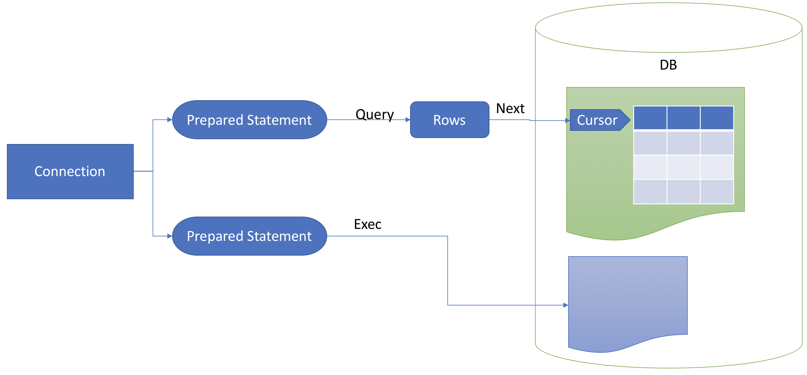

# 16 MySQL

與 Java JDBC 類似，Go 有定義一套 interface，所有要連 DB 的 driver，都需要實作這些 interface (["database/sql/driver"](https://golang.org/pkg/database/sql/driver/))。以下我是用 [go-sql-driver/mysql](https://github.com/go-sql-driver/mysql)

**Test table schema** (MySQL):

```sql
CREATE TABLE `member` (
  `id` int(11) NOT NULL AUTO_INCREMENT,
  `name` varchar(100) NOT NULL DEFAULT '',
  `info` text,
  `birthday` date DEFAULT NULL,
  `register` datetime NOT NULL,
  `login` datetime NOT NULL,
  `vip` char(1) NOT NULL DEFAULT 'A',
  `created` datetime NOT NULL DEFAULT CURRENT_TIMESTAMP,
  `updated` datetime NOT NULL DEFAULT CURRENT_TIMESTAMP ON UPDATE CURRENT_TIMESTAMP,
  PRIMARY KEY (`id`),
  UNIQUE KEY `id` (`id`)
) ENGINE=InnoDB DEFAULT CHARSET=utf8
```

**sample code**:

```go { .line-numbers }
package main

//go:generate docker rm -f go_course_db
//go:generate docker build -t go_course_ex16/db:latest .
//go:generate docker run -d --name=go_course_db -p 3306:3306 go_course_ex16/db:latest

import (
    "database/sql"
    "encoding/json"
    "errors"
    "fmt"
    "log"
    "time"

    _ "github.com/go-sql-driver/mysql"
)

// Member ...
type Member struct {
    ID       int
    Name     string
    Info     string
    Birthday time.Time // MySQL min Date: 1000-01-01
    Register time.Time // MySQL min DateTime: 1000-01-01 00:00:00
    Login    time.Time // MySQL min DateTime: 1000-01-01 00:00:00
    VIP      string
    Created  time.Time
    Updated  time.Time
}

func (m *Member) String() string {
    memberBytes, err := json.Marshal(m)
    if err != nil {
        return err.Error()
    }

    return string(memberBytes)
}

// Connect ...
func Connect() (*sql.DB, error) {
    db, err := sql.Open("mysql", "abc:1234test@tcp(localhost)/mytest?charset=utf8mb4,utf8&parseTime=true")
    if err != nil {
        return nil, err
    }
    return db, nil
}

// GetMember ...
func GetMember(db *sql.DB, id int64) (*Member, error) {
    mem := &Member{}
    err := db.QueryRow("select id, name, info, birthday, register, login, vip, created, updated from member where id = ?", id).Scan(&mem.ID, &mem.Name, &mem.Info, &mem.Birthday, &mem.Register, &mem.Login, &mem.VIP, &mem.Created, &mem.Updated)

    if err != nil {
        return nil, err
    }
    return mem, nil
}

func main() {

    db, err := Connect()
    if err != nil {
        log.Fatal("connect:", err)
    }
    defer db.Close()

    birthday := time.Date(0, time.January, 1, 0, 0, 0, 0, time.UTC) //time.Parse("2006-01-02", "1000-01-01")
    register := time.Date(0, time.January, 1, 0, 0, 0, 0, time.UTC)
    login := time.Now()

    m1 := &Member{
        Name:     "小明",
        Info:     "小明",
        Birthday: birthday,
        Register: register,
        Login:    login,
        VIP:      "A",
    }
    log.Println("member:", m1)

    ins, err := db.Prepare("insert into member(name, info, birthday, register, login, vip) values(?, ?, ?, ?, ?, ?)")
    if err != nil {
        log.Println("prepare insert:", err)
        return
    }
    defer ins.Close()

    result, err := ins.Exec(m1.Name, m1.Info, m1.Birthday, m1.Register, m1.Login, m1.VIP)
    if err != nil {
        log.Println("insert:", err)
        return
    }

    id, err := result.LastInsertId()
    if err != nil {
        log.Println("last id:", err)
        return
    }

    sel, err := db.Prepare("select id, name, info, birthday, register, login, vip, created, updated from member where id = ?")
    if err != nil {
        log.Println("prepare select:", err)
        return
    }
    defer sel.Close()

    rows, err := sel.Query(id)
    if err != nil {
        log.Println("query:", err)
        return
    }

    defer rows.Close()

    if rows.Next() {
        m2 := &Member{}
        err = rows.Scan(&m2.ID, &m2.Name, &m2.Info, &m2.Birthday, &m2.Register, &m2.Login, &m2.VIP, &m2.Created, &m2.Updated)
        if err != nil {
            log.Println("scan:", err)
            return
        }
        fmt.Println("get member:", m2)
    } else {
        log.Printf("data (%d) not found\n", id)
    }

    other, err := GetMember(db, 100)
    if err != nil {
        if errors.Is(err, sql.ErrNoRows) {
            fmt.Println("id 100 not found")
        } else {
            fmt.Println("other error:", err)
        }
    } else {
        fmt.Println("other member:", other)
    }

    fmt.Println("end")
}
```

## Connection

1. import package.

    ```go { .line-numbers }
    import (
        "database/sql"
        _ "github.com/go-sql-driver/mysql"
    )
    ```

    1. `"database/sql"` 是 go 定義 sql interface 的 package
    1. `_ "github.com/go-sql-driver/mysql"` mysql driver package

1. 定義資料的 struct，類似要做 ORM 的動作，當然也可以不要這個定義，都用變數來存資料。

    ```go { .line-numbers }
    // Member ...
    type Member struct {
        ...
    }
    ```

1. 連線資料庫

    ```go { .line-numbers }
    func Connect() (*sql.DB, error) {
        db, err := sql.Open("mysql", "abc:1234test@tcp(localhost)/mytest?charset=utf8mb4,utf8&parseTime=true")
        if err != nil {
            return nil, err
        }
        return db, nil
    }
    ```

    與 JDBC 連線類似，指定 driver 的種類，並傳入一組 url 的設定, 格式是：`[username[:password]@][protocol[(address)]]/dbname[?param1=value1&...&paramN=valueN]`。詳細的說明，請見：[DSN (Data Source Name)](https://github.com/go-sql-driver/mysql#dsn-data-source-name)。我在連線後，可以多做了 Ping 的動作，如下：

    ```go { .line-numbers }
    if err := db.Ping(); err != nil {
        return nil, err
    }
    ```

    記得取的 db 連線後，立即下 `defer db.Close()`，確保程式在結束後，會關閉連線。如下：

    ```go { .line-numbers }
    db, err := Connect()
    if err != nil {
        log.Fatal("connect:", err)
    }
    defer db.Close()
    ```

## Insert

```go { .line-numbers }
birthday := time.Date(0, time.January, 1, 0, 0, 0, 0, time.UTC)
register := time.Date(0, time.January, 1, 0, 0, 0, 0, time.UTC)
login := time.Now()

m1 := Member{
    Name:     "小明",
    Info:     "小明",
    Birthday: birthday,
    Register: register,
    Login:    login,
    VIP:      "A",
}
log.Println(m1)

ins, err := db.Prepare("insert into member(name, info, birthday, register, login, vip) values(?, ?, ?, ?, ?, ?)")
if err != nil {
    log.Println("prepare insert:", err)
    return
}
defer ins.Close()

result, err := ins.Exec(m1.Name, m1.Info, m1.Birthday, m1.Register, m1.Login, m1.VIP)
if err != nil {
    log.Println("insert:", err)
    return
}
defer ins.Close()

id, err := result.LastInsertId()
if err != nil {
    log.Println("last id:", err)
    return
}
```

說明：

1. 利用 DB.Pepare 建立一個 PreparedStatement 連線，記得下 `defer ins.Close()`

    ```go { .line-numbers }
    ins, err := db.Prepare("insert into member(name, info, birthday, register, login, vip) values(?, ?, ?, ?, ?, ?)")
    if err != nil {
        log.Println("prepare insert:", err)
        return
    }
    defer ins.Close()
    ```

1. 使用 Stmt.Exec 執行指 SQL 指令。

    ```go { .line-numbers }
    result, err := ins.Exec(m1.Name, m1.Info, m1.Birthday, m1.Register, m1.Login, m1.VIP)
    if err != nil {
        log.Println("insert:", err)
        return
    }
    defer ins.Close()

    id, err := result.LastInsertId()
    if err != nil {
        log.Println("last id:", err)
        return
    }
    ```

    Result 功能：

    1. LastInsertId(): 取得 **auto_increment** 的 id
    1. RowsAffected(): 取得異動的資料筆數，注意，[文件](https://golang.org/pkg/database/sql/#Result)上說並非所有的 driver 都會實作。

**Update/Delete** 與 Insert 類似。

## Select

1. 下 SQL，與 Java 的 PreparedStatement 類似。

    ```go { .line-numbers }
    sel, err := db.Prepare("select id, name, info, birthday, register, login, vip, created, updated from member where id = ?")
    if err != nil {
        log.Println("prepare select:", err)
        return
    }
    defer sel.Close()
    ```

    與上述 db 類似，取得連線後，記得下 `defer sel.Close()` 確保程式結束後，會關閉 statement 連線。

1. 使用 Stmt.Query 方式，取得 Rows

    ```go { .line-numbers }
    rows, err := sel.Query(id)
    if err != nil {
        log.Println("query:", err)
        return
    }

    defer rows.Close()
    ```

    與上述取得連線一樣，立即下 `defer rows.Close()` 確保程式結束後，會關閉 rows。(說明文件說，會[自動關閉](https://golang.org/pkg/database/sql/#Rows.Close)。這部分就看自己的習慣了。但 DB 與 Stmt 一定要記得關。)

1. 一定要先執行 **Next** 才能取資料。

    ```go { .line-numbers }
    if rows.Next() {
        m2 := Member{}
        err = rows.Scan(&m2.ID, &m2.Name, &m2.Info, &m2.Birthday, &m2.Register, &m2.Login, &m2.VIP, &m2.Created, &m2.Updated)
        if err != nil {
            log.Println("scan:", err)
            return
        }
        bytes, _ := json.Marshal(m2)
        fmt.Println(string(bytes))
    } else {
        log.Printf("data (%d) not found\n", id)
    }
    ```

1. 透過 Rows.Scan 取得資料。

    ```go { .line-numbers }
    err = rows.Scan(&m2.ID, &m2.Name, &m2.Info, &m2.Birthday, &m2.Register, &m2.Login, &m2.VIP, &m2.Created, &m2.Updated)
    if err != nil {
        log.Println("scan:", err)
        return
    }
    ```

## Fast Query/Insert

上述的例子，是使用 `Stmt` 執行 SQL，並透過 `Rows` 來取得資料。如果不是需要重覆使用 `Stmt`時，可以直接用 `DB` 的 `DB.Query` 取得 `Rows`，或用 `DB.Exec` 執行 SQL。

如果只要取得單一筆資料，可以用 `DB.QueryRow` 取的 `Row` 物件，再直接用 `Row.Scan` 取得資料。

```go { .line-numbers }
func GetMember(db *sql.DB, id int64) (*Member, error) {
    mem := &Member{}
    err := db.QueryRow("select id, name, info, birthday, register, login, vip, created, updated from member where id = ?", id).Scan(&mem.ID, &mem.Name, &mem.Info, &mem.Birthday, &mem.Register, &mem.Login, &mem.VIP, &mem.Created, &mem.Updated)

    if err != nil {
        return nil, err
    }
    return mem, nil
}
```

可利用 `errors.Is(err, sql.ErrNoRows)` 來判斷資料是否存在。

## Connect, Prepared Statement, Rows, Cursor 關係


