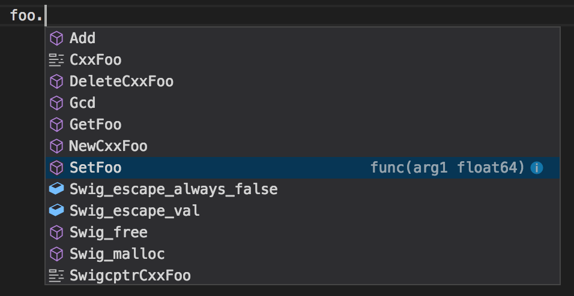

# 16 Cowork with C/C++ (swig)

在 Golang 有 cgo 與 gccgo 可以與 C 的程式互動。在 compile Golang 的程式時，可以 link C 的 library。

但 Golang 無法直接使用 C++ 程式，因為 Golang 本身沒有 OOP 的設計，所以必須在 C++ 再封裝一層程式來使用。目前 golang 有支援 [Swig](http://www.swig.org/) 工具，可以協助封裝 C/C++ 程式。

## Golang unsafe Package

因為 Go 的 `unsafe` 使用到系統底層的屬性，所以會失去相容與移植。如非必要，儘可能不要使用。

unsafe package 主要有三個 function 與一個 data type

- functions:
  - func Alignof(x ArbitraryType) uintptr: memory alignment
    > The unsafe.Alignof function reports the required alignment of its argument’s type. Like Sizeof, it may be applied to an expression of any type, and it yields a constant. Typically, boolean and numeric types are aligned to their size (up to a maximum of 8 bytes) and all other types are word-aligned. (where a **word** is **4** bytes on a **32-bit** platform and **8** bytes on a **64-bit** platform)

  - func Offsetof(x ArbitraryType) uintptr: offset from start for struct and array
  - func Sizeof(x ArbitraryType) uintptr: size of for type
- data type:
  - type Pointer: 等同 void* in c. [Go reference to C](https://golang.org/cmd/cgo/#hdr-Go_references_to_C)
     > The C type void* is represented by Go's unsafe.Pointer

### Sizeof and Alignof

```go {.line-numbers}
package main

import (
    "fmt"
    "unsafe"
)

func main() {
    var x struct {
        a bool
        b float64
        c int16
    }

    fmt.Println("Sizeof x:", unsafe.Sizeof(x))
    fmt.Println("Alignof x:", unsafe.Alignof(x))

    fmt.Println("Sizeof x.a:", unsafe.Sizeof(x.a), "AlignOf x.a:", unsafe.Alignof(x.a), "Offsetof x.a:", unsafe.Offsetof(x.a))
    fmt.Println("Sizeof x.b:", unsafe.Sizeof(x.b), "AlignOf x.b:", unsafe.Alignof(x.b), "Offsetof x.b:", unsafe.Offsetof(x.b))
    fmt.Println("Sizeof x.c:", unsafe.Sizeof(x.c), "AlignOf x.c:", unsafe.Alignof(x.c), "Offsetof x.c:", unsafe.Offsetof(x.c))

    var y struct {
        a float64
        b int16
        c bool
    }

    fmt.Println("Sizeof y:", unsafe.Sizeof(y))
    fmt.Println("Alignof y:", unsafe.Alignof(y))

    fmt.Println("Sizeof y.a:", unsafe.Sizeof(y.a), "AlignOf y.a:", unsafe.Alignof(y.a), "Offsetof y.a:", unsafe.Offsetof(y.a))
    fmt.Println("Sizeof y.b:", unsafe.Sizeof(y.b), "AlignOf y.b:", unsafe.Alignof(y.b), "Offsetof y.b:", unsafe.Offsetof(y.b))
    fmt.Println("Sizeof y.c:", unsafe.Sizeof(y.c), "AlignOf y.c:", unsafe.Alignof(y.c), "Offsetof y.c:", unsafe.Offsetof(y.c))

    var z struct {
        a bool
        b int16
        c float64
    }

    fmt.Println("Sizeof z:", unsafe.Sizeof(z))
    fmt.Println("Alignof z:", unsafe.Alignof(z))

    fmt.Println("Sizeof z.a:", unsafe.Sizeof(z.a), "AlignOf y.a:", unsafe.Alignof(z.a), "Offsetof z.a:", unsafe.Offsetof(z.a))
    fmt.Println("Sizeof z.b:", unsafe.Sizeof(z.b), "AlignOf y.b:", unsafe.Alignof(z.b), "Offsetof z.b:", unsafe.Offsetof(z.b))
    fmt.Println("Sizeof z.c:", unsafe.Sizeof(z.c), "AlignOf y.c:", unsafe.Alignof(z.c), "Offsetof z.c:", unsafe.Offsetof(z.c))
}
```

Output:

```text
Sizeof x: 24
Alignof x: 8
Sizeof x.a: 1 AlignOf x.a: 1 Offsetof x.a: 0
Sizeof x.b: 8 AlignOf x.b: 8 Offsetof x.b: 8
Sizeof x.c: 2 AlignOf x.c: 2 Offsetof x.c: 16
Sizeof y: 16
Alignof y: 8
Sizeof y.a: 8 AlignOf y.a: 8 Offsetof y.a: 0
Sizeof y.b: 2 AlignOf y.b: 2 Offsetof y.b: 8
Sizeof y.c: 1 AlignOf y.c: 1 Offsetof y.c: 10
Sizeof z: 16
Alignof z: 8
Sizeof z.a: 1 AlignOf y.a: 1 Offsetof z.a: 0
Sizeof z.b: 2 AlignOf y.b: 2 Offsetof z.b: 2
Sizeof z.c: 8 AlignOf y.c: 8 Offsetof z.c: 8
```

x, y, z 在 64-bit 系統下， alignment 都是 8 bytes. 但 x 的 size 是 24 bytes (3 words[^word])，而其他 y, z 都是 16 bytes (2 words)。
主要因為 x 的 bool (x.a) 與 int16 (x.c) 中間是 float64 (x.b)，佔了 8 bytes (1 word)，bool 雖只佔 1 byte，但要補足成 8 bytes (1 word), 同理 x.c 只佔 2 bytes，也要補足成 8 bytes (1 word)。
而 y, z 因為 bool, int16 是相連，因此在 bool 後面補 1 bytes, int16 補 4 bytes，補足成 8 bytes(1 word)。所以 x 是 24 bytes，而 y, z 是 16 bytes。[^src_sample]

[^word]: 在 32 bit 系統下，1 word = 4 bytes (32bit), 64 bit 是 8 bytes (64bit)
[^src_sample]: [unsafe.Sizeof, Alignof 和 Offsetof](https://wizardforcel.gitbooks.io/gopl-zh/ch13/ch13-01.html)

### unsafe.Pointer

unsafe.Pointer 可以是任意型別的指標。在 Golang 的 strong type 安全機制下，不同的資料型別與指標都不可以直接轉換，如：

- 不同指標的值，即使是相同 bit 數，如 int64 和 float64。
- 指標 與 uintptr 的值。

unsafe.Pointer 可以破壞 Go 的安全機制；unsafe.Pointer 的功能有：

1. 任何資料型別的指標，都可以轉成 unsafe.Pointer。
1. unsafe.Pointer 也可轉成任何資料型別的指標。
1. unsafe.Pointer 可以轉成 uintptr，之後可以利用 uintptr 做指標位移。
1. uintptr 可以轉成 unsafe.Pointer，但有風險。

unsafe.Pointer 一定要遵守[官網](https://golang.org/pkg/unsafe/#Pointer)提到的使用模式，官網有提到，如果沒有遵守的話，現在雖然沒問題，但在未來不一定正確。

1. Conversion of a *T1 to Pointer to *T2，前提 T2 的記憶體空間，要小於或等於 T1。如果 T2 > T1 的話，有可能在操作 T2 時，會造成溢位。

    ```go {.line-numbers}
    package main

    import (
        "fmt"
        "unsafe"
    )

    func main() {

        f := 3.1415926
        t1 := *(*uint64)(unsafe.Pointer(&f))
        fmt.Printf("%v, %T\n", t1, t1)

        t2 := *(*uint32)(unsafe.Pointer(&f))
        fmt.Printf("%v, %T\n", t2, t2)

        var f1 float32 = 3.1415926
        t3 := (*uint64)(unsafe.Pointer(&f1))
        fmt.Printf("%v, %v, %T\n", t3, *t3, t3)
        fmt.Printf("%v, %v, %T\n", &f1, f1, f1)

        *t3 = 1<<63 - 1
        fmt.Printf("%v, %T\n", *t3, t3)
        fmt.Printf("%v, %T\n", f1, f1)
    }
    ```

    以上 t3 是 *uint64，大於 float32，在最後造成 float32 溢位

1. Conversion of a Pointer to a uintptr (but not back to Pointer)

    >Even if a uintptr holds the address of some object, the garbage collector will not update that uintptr's value if the object moves, nor will that uintptr keep the object from being reclaimed.

    官網文件提到，Pointer 可以轉 uintptr，但反之 uintptr 轉 Pointer 不行。因為 uintptr 只是存當時的記憶體位址，但實體 (instance) 有可能已經被 GC (Garbage collection)，因此轉成 Pointer 操作後，會有問題。下面的例子中，Go 的工具會幫忙檢查。(go vet)

    ```go {.line-numbers}
    package main

    import (
        "fmt"
        "unsafe"
    )

    func main() {
        a := 10

        ap1 := uintptr(unsafe.Pointer(&a))

        fmt.Printf("%x, %T\n", ap1, ap1)

        ap2 := (*int)(unsafe.Pointer(ap1)) // warning: possible misuse of unsafe.Pointer

        fmt.Printf("%x, %v, %T\n", ap2, *ap2, ap2)
    }
    ```

1. Conversion of a Pointer to a uintptr and back, with arithmetic.

    指標位移

    ```go {.line-numbers}
    package main

    import (
        "fmt"
        "unsafe"
    )

    type test struct {
        name string
        age  int
        addr string
    }

    func main() {

        slice := []int{1, 2, 3, 4, 5}

        snd := *(*int)(unsafe.Pointer(uintptr(unsafe.Pointer(&slice[0])) + 1*unsafe.Sizeof(slice[0])))
        fmt.Printf("%v, %T\n", snd, snd)

        t := test{"A", 10, "ABC"}

        addr := *(*string)(unsafe.Pointer((uintptr(unsafe.Pointer(&t)) + unsafe.Offsetof(t.addr))))
        fmt.Printf("%v, %T\n", addr, addr)
    }
    ```

    以下的操作方式是**不正確**的，雖然是可以執行。

    1. 取資料的結束位址
    1. 先用變數保留 uintptr 再轉回 Pointer

    ```go {.line-numbers}
    package main

    import (
        "fmt"
        "unsafe"
    )

    type test struct {
        name string
        age  int
        addr string
    }

    func main() {
        slice := []int{1, 2, 3, 4, 5}

        out := unsafe.Pointer(uintptr(unsafe.Pointer(&slice[0])) + uintptr(len(slice))) // 取結束位址
        fmt.Println(out)

        // 暫存 uintptr, 再轉成 unsafe.Pointer()
        firstp := uintptr(unsafe.Pointer(&slice[0]))
        sndp := firstp + unsafe.Sizeof(slice[0])

        snd := *(*int)(unsafe.Pointer(sndp)) // warning: possible misuse of unsafe.Pointer
        fmt.Printf("snd: %v %T\n", snd, snd)

        t := test{"A", 10, "ABC"}

        end := unsafe.Pointer(uintptr(unsafe.Pointer(&t)) + unsafe.Sizeof(t)) // 取結束位址
        fmt.Println(end)
    }
    ```

1. Conversion of a Pointer to a uintptr when calling syscall.Syscall.
1. Conversion of the result of reflect.Value.Pointer or reflect.Value.UnsafeAddr from uintptr to Pointer.

    ```go {.line-numbers}
    package main

    import (
        "fmt"
        "reflect"
        "unsafe"
    )

    type test struct {
        name string
        age  int
        addr string
    }

    func main() {
        p := (*int)(unsafe.Pointer(reflect.ValueOf(new(int)).Pointer()))
        fmt.Printf("%v, %v, %T\n", p, *p, p)
        *p = 200
        fmt.Printf("%v, %v, %T\n", p, *p, p)
    }
    ```

1. Conversion of a reflect.SliceHeader or reflect.StringHeader Data field to or from Pointer.

    ```go {.line-numbers}
    package main

    import (
        "fmt"
        "reflect"
        "unsafe"
    )

    type test struct {
        name string
        age  int
        addr string
    }

    func main() {
        str := "hello world"

        hdr := (*reflect.StringHeader)(unsafe.Pointer(&str))
        fmt.Printf("%x, %x, %v\n", &str, uintptr(unsafe.Pointer(hdr)), hdr)

        str = str + "DEF"
        hdr = (*reflect.StringHeader)(unsafe.Pointer(&str))
        fmt.Printf("%x, %x, %v\n", &str, uintptr(unsafe.Pointer(hdr)), hdr)

        str2 := "ok"
        hdr2 := (*reflect.StringHeader)(unsafe.Pointer(&str2))
        *hdr = *hdr2
        fmt.Printf("%x, %x, %v\n", &str, uintptr(unsafe.Pointer(hdr)), hdr)

        a, b := "A", "BB"

        hdra := (*reflect.StringHeader)(unsafe.Pointer(&a))
        fmt.Printf("%x, %x, %v\n", &a, uintptr(unsafe.Pointer(hdra)), hdra)

        a = b
        hdra = (*reflect.StringHeader)(unsafe.Pointer(&a))
        fmt.Printf("%x, %x, %v\n", &a, uintptr(unsafe.Pointer(hdra)), hdra)
    }
    ```

    由上例中可知：
    1. `&string` 代表取出 `*StringHeader`。
    1. 做完 `str = str + "DEF"`，`StringHeader.Data` 的值，已經被修改了，也就代表產生一個新的字串資料。但原本 StringHeader 的位址不變
    1. `*hdr = *hdr2` 等同 `str = str2`，因為整個 StringHeader 的值都被更改了。

## Swig Introduction

[Swig](http://www.swig.org/) 可以將 C/C++ 與其他高階語言(eg: PHP, Java, C#，Go) 等結合的工具，其原理是將 C/C++ 再用對應的程式語言封裝。Go 的 build 工具已內建整合 Swig。

### 範例

專案目錄: `class20/swig_test`

```text
├── foo
│   ├── foo.cpp
│   ├── foo.go
│   ├── foo.hpp
│   └── foo.swigcxx
└── main.go
```

#### foo/foo.hpp

```C++ {.line-numbers}
#pragma once

extern double Foo;

class cxxFoo {
public:
    int a;
    cxxFoo(int _a): a(_a) {};
    ~cxxFoo() {};
    void Bar();
};

extern int gcd(int x, int y);
extern double add(double x);
```

#### foo/foo.cpp

```C++ {.line-numbers}
#include <iostream>
#include "foo.hpp"

double Foo = 3.0;

void cxxFoo::Bar(void) {
    std::cout << this->a<<std::endl;
}

int gcd(int x, int y) {
    int g;
    g = y;

    while (x > 0) {
        g = x;
        x = y % x;
        y = g;
    }

    return g;
}

double add(double x) {
    return x + Foo;
}
```

#### foo/foo.swigcxx

```text {.line-numbers}
%module myfoo
%{
#include "foo.hpp"
%}
%include "foo.hpp"
```

#### foo/foo.go

```go {.line-numbers}
package foo
```

#### main.go

```go {.line-numbers}
package main

import (
    "fmt"
    "go_test/class16/swig/foo"
)

func main() {
    f := foo.NewCxxFoo(10)
    fmt.Println(foo.Add(10.0))
    f.Bar()
    foo.DeleteCxxFoo(f)
    fmt.Println(foo.Gcd(12, 16))
    foo.SetFoo(100.0)
    fmt.Println(foo.GetFoo())
    fmt.Println("end")
}
```

### Compile

在專案目錄 `swig_test` 下，先執行 `go clean -x -cache`，清除舊的 cache，再執行 `go build -x -work`。

1. `-x` 是列印所有編譯的指令
1. `-work` 是列印出中繼的產檔目錄

在所有指令中，`go build` 會自動去執行 `swig` 指令: `swig -go -cgo -intgosize 64 -module foo -o $WORK/b023/foo_wrap.cxx -outdir $WORK/b023/ -C++ foo.swigcxx`。
想了解 swig 怎麼封裝，可以到 `$WORK` 目錄下，看產生出來的中斷檔 `_foo_swig.go`



#### swig 說明

- `foo/foo.hpp` and `foo/foo.cpp`: C++ 程式，有一組 class, 一個 global 變數，二個 global functions
- `foo/foo.go`: 空白的 go 程式，避免在 build 程式時，`go build` 發生 `foo` package 沒有 go 的程式
- `foo/foo.swigcxx`: swig 的 interface 檔案。
    1. 如果是要連 C++ 程式，副檔名要用 `.swigcxx`，如果是 C 程式，副檔名 `.swig`
    1. interface 的檔名，要與 package 名稱相同
    1. 因為是 go build 會自定 module 名稱，因此檔案中的 `module myfoo` 就無用
    1. interface 的寫法，就把 C++ 的 header 放入
    1. 如果想看中繼檔，可到 `$WORK` 目錄。eg: `/var/folders/5t/jkthvjgn0gxc7k98wczh5k1c0000gn/T/go-build519318596/b023/`
- swig 封裝原則
    1. C++ 的 class 會轉成 Go interface
    1. class 的 public member data 會產生對應的 Get 及 Set Functions.
    1. C++ 的 new/delete class, 會有 NewClass 及 DeleteClass 的對應
    1. Global 變數，也會有 Get/Set 的對應。
    1. Global function 會改成第一個字母大寫的 function.

## Wrap C++ Class with C

Go 主要是透過 [cgo](https://golang.org/cmd/cgo/) 來與 C 程式結合，也可以直接在 go 的 source code 中，加入 C 的程式碼，如果要接 C++ 的程式，就需要像 swig 的做法，在 C++ 包一層 C 的程式，再與 Go 對接。

### 直接在 go 的程式碼中，加入 C 的程式

```go {.line-number}
package main

// #include "stdlib.h"
// #include "stdio.h"
// #define b (5)
// int add(int a) {
//   return a + b;
// }
import "C"
import "fmt"

func main() {
    fmt.Println(C.add(100))
}
```

1. 要使用 C 的程式時，一定要 `import "C"`，之後與 C 程式的互動，都會由這個 `C` 的 package 來負責
1. 在 `import "C"` 上面，用註解的方式加入 C 的程式，之後如果是載入 library 的話，也是用註解的方式加入。
1. 使用 C 的程式，都是透過 `C` 這個 package 來呼叫，如: `C.add(100)`

Go 與 C 的數字型別，剛好是一對一的對應。比如 Go 的 int 等同 C 的 int, Go 的 float64 等同 C 的 double. 如果是指標的話，Go 需先轉成 unsafe.Pointer 後，再轉型成 C 的指標。

要特別注意的是 String, 當 Go 的 `string` 轉成 C 的 `*char` 時(透過 `func C.CString(string) *C.char`), 使用完後，記使用 `C.free` 來釋放記憶體，因為在轉換的過程，會使用 `malloc`。

### Go string and C *char

```go {.line-numbers}
package main

/*
#include "stdlib.h"
#include "stdio.h"

void list(const char** str, const int size) {
    for(int i = 0; i < size; i++) {
        printf("%d:%s\n", i, str[i]);
    }
    fflush(stdout);
}
*/
import "C"

import (
    "unsafe"
)

func main() {
    strings := []string{"hello", "world"}

    tmp := make([]*C.char, len(strings))

    // Go string to C *char
    for i, str := range strings {
        tmp[i] = C.CString(str)
    }

    C.list(&tmp[0], C.int(len(strings)))

    // Free all C *char
    for _, x := range tmp {
        C.free(unsafe.Pointer(x))
    }
}
```

1. 使用 `C.CString` 將 Go `string` 轉成 C 的 `*char`
1. 因為 strong type 關係，需用 `C.int(x)` 將 Go 的 int 轉成 C 的 int
1. 用 `&tmp[0]` 取得 `**char`，不能用 `&tmp` (∵ `&tmp` 是取到 `*reflect.SliceHeader`)
1. 最後用 `C.free` 釋放記憶體，需用 `unsafe.Pointer` 將 `*char` 轉成 `*void`

### Go call C++

除了用 Swig 外，也可以自行將 C++ 透過 C，包裝成 library，再讓 Go 使用。

```text
cxx_test
├── Makefile
├── cfoo.cpp
├── foo.cpp
├── main.go
├── foo.h
└── foo.hpp
```

#### foo.hpp

```c++ {.line-numbers}
#pragma once

class cxxFoo {
public:
    int a;
    cxxFoo(int _a): a(_a) {};
    ~cxxFoo() {};
    void Bar();
};

class cxxTest {
public:
    cxxTest(const int argc, const char **argv, int *pnErr);
    ~cxxTest();
};
```

#### foo.cpp

```c++ {.line-numbers}
#include <iostream>
#include "foo.hpp"

void cxxFoo::Bar(void) {
    std::cout << this->a<<std::endl;
}

cxxTest::cxxTest(const int argc, const char **argv, int *err) {

    for(int i = 0; i < argc; i++) {
        std::cout << argv[i] << std::endl;
    }
    *err = 100;
}

cxxTest::~cxxTest() {
    std::cout << "delete cxxTest" << std::endl;
}
```

#### foo.h

```c {.line-numbers}
#pragma once

#ifdef __cplusplus
extern "C" {
#endif

typedef void* Foo;
typedef void* Test;

Foo FooInit(void);
void FooFree(Foo);
void FooBar(Foo);

Test TestNew(const int argc, const char **argv, int *err);
void TestFree(Test);

#ifdef __cplusplus
}
#endif
```

#### cfoo.cpp

```c++ {.line-numbers}
#include "foo.hpp"
#include "foo.h"

Foo FooInit() {
    cxxFoo *ret = new cxxFoo(1);
    return (void *)ret;
}

void FooFree(Foo f) {
    cxxFoo *foo = (cxxFoo *)f;
    delete foo;
}

void FooBar(Foo f) {
    cxxFoo *foo = (cxxFoo *)f;
    foo->Bar();
}

Test TestNew(const int argc, const char **argv, int *err) {
    cxxTest *ret = new cxxTest(argc, argv, err);
    return (void *)ret;
}

void TestFree(Test t) {
    cxxTest *tt = (cxxTest *)t;
    delete tt;
}
```

#### cxx_test/main.go

```go {.line-numbers}
package main

// #cgo LDFLAGS: -L. -lfoo
// #include "foo.h"
// #include "stdlib.h"
import "C"
import (
    "fmt"
    "unsafe"
)

func conv(args []string) []*C.char {
    ret := make([]*C.char, len(args))

    for i, x := range args {
        ret[i] = C.CString(x)
    }

    return ret
}

// New ...
func New() C.Test {
    var args = []string{"A", "B", "C"}

    xx := conv(args)

    aa := C.int(100)
    a := &aa

    t := C.TestNew(3, &xx[0], a)
    fmt.Println(aa)

    for _, v := range xx {
        C.free(unsafe.Pointer(v))
    }

    return t

}

func main() {

    foo := C.FooInit()
    C.FooBar(foo)
    C.FooFree(foo)

    t := New()
    C.TestFree(t)

}
```

#### Makefile

```makefile {.line-numbers}
.PHONY: clean

TARGET=cxx_test

$(TARGET): libfoo.a
    go build -x -work .

libfoo.a: foo.o cfoo.o
    ar r $@ $^

%.o: %.cpp
    g++ -O2 -o $@ -c $^

clean:
    rm -f *.o *.so *.a $(TARGET)
    go clean -x -cache
```

1. foo.hpp, foo.cpp: C++ 程式
1. foo.h, cfoo.cpp: 封裝 foo.hpp/foo.cpp 的程式，之後 Go 會對應 foo.h
1. foo.go: Go 程式

原理：

1. 因為 Go 無法直接用 C++ 程式，因此封裝一層 C++ 程式，外層只用 C 語言特性，讓 Go 透過這層 C interface 與底層 C++ 溝通。
1. 對應 class 的 new/delete，因為 Go 無法使用，因此 C 的 interface 需要有相對應的 function 來處理。
1. 將 C/C++ 程式，compile 成 library
1. 在 Go 程式 (foo.go) 連結 library
    - `// #cgo LDFLAGS: -L. -lfoo`
1. 因為 link library 關係，無法使用 go run foo.go 執行程式 (?), link 路徑錯誤。[^import-path]

[^import-path]: `command-line-arguments` 關係，請見 [go build](http://wiki.jikexueyuan.com/project/go-command-tutorial/0.1.html)

## reference

1. [[译]Go里面的unsafe包详解Ｖ](https://gocn.io/question/371)
1. [Go 1 and the Future of Go Programs#Expections](https://golang.org/doc/go1compat#expectations)
1. [GO 命令教程](http://wiki.jikexueyuan.com/project/go-command-tutorial/)

### How does this work

```C++ {.line-numbers}
class CRect {
    private:
        int m_color;
    public:
    void setcolor(int color) {
        m_color = color;
    }
}
```

```C++ {.line-numbers}
class CRect {
    private:
        int m_color;
    public:
    void setcolor(int color, (CRect*)this) {
        this->m_color = color;
    }
}
```

from: 物件導向的精髓 多型與虛擬 (Polymorphism in C++) 作者：侯俊傑
